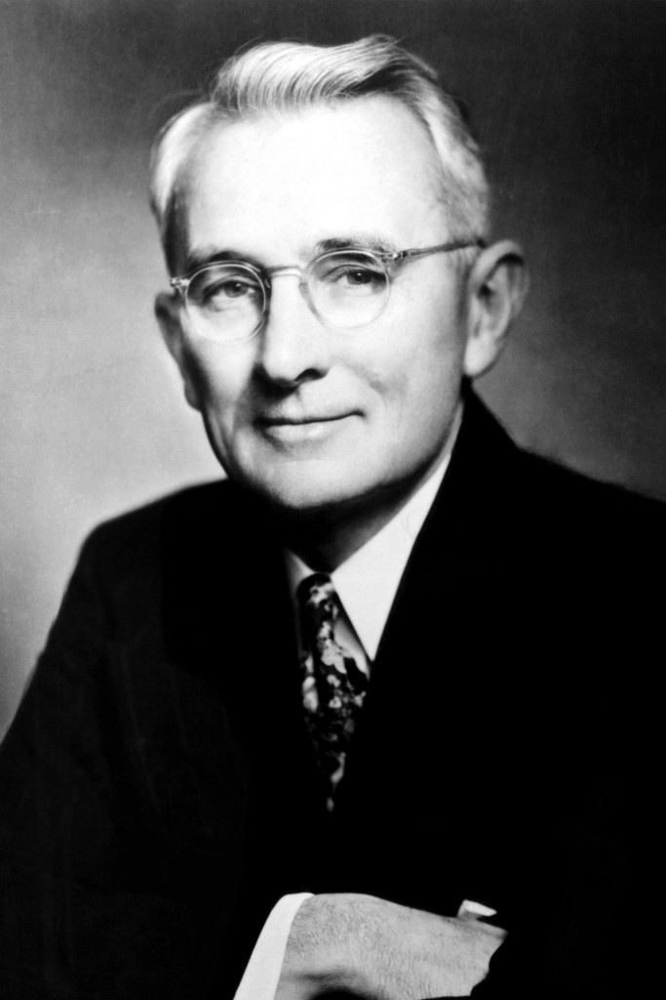

# Midterm Exam: Overall Score Distribution


---

# Midterm Exam: Question #1 Score Distribution


---

# Midterm Exam: Question #2 Score Distribution


---

# Midterm Exam: Question #3 Score Distribution


---

# Midterm Exam: Question #3 Solution


``` C
int main() {
int a = 1;                  // VALID
    int x = 2;int y = 3;    // VALID
    return 0;
}
```

---

# Midterm Exam: Question #4 Score Distribution


---

# Midterm Exam: Question #5 Score Distribution


---

# Midterm Exam: Question #6 Score Distribution


---

# Midterm Exam: Question #6 Solution


- Look closely at the first `if`: `opt = '+'` and NOT `opt == '+'`
- In C (and many programming languages), the *value* of the assignment operator `=` is equal to the assigned value.
- Why? So you can chain assignments, e.g., `x = y = 10;`
- So, the value of `opt = '+'` is nonzero, i.e., logical *true*.

---

# Midterm Exam: Question #7 Score Distribution


---

# Midterm Exam: Question #8 Score Distribution


---

# Midterm Exam: Question #9 Score Distribution


---

# Midterm Exam: Question #10 Score Distribution


---



# "...investigations revealed that even in such technical lines as engineering, about 15 percent of one’s financial success is due to one’s technical knowledge and about 85 percent is due to skill in human engineering — to personality and the ability to lead people."

## — Dale Carnegie, *How to Win Friends and Influence People*, 1936

---

<!-- _header:  -->

# UESTC 1005 — Introductory Programming

<h2>Lecture 11 &mdash; Structures and Bit Manipulation</h2>

Dr. Mark D. Butala

<!-- transition: fade -->
<!-- <style scoped>a { color: #eee; }</style> -->

<!-- This is presenter note. You can write down notes through HTML comment. -->

<style scoped>
    .team-table {
        .bottom: 1%;
    }
</style>

<div align="center">
<p style="margin-bottom:0.5cm;">

| Chengdu Team | Hainan Team |
|--------------|-------------|
| Dr. Syed M. Raza | Dr. Mark D. Butala |
| Dr. Ahmad Zoha | Prof. Bo Liu |
| Dr. Hassan T. Abbas | Prof. Chong Li |

</p>
</div>

---

# Questions 🙋❓

- Ask me anything (programming-related 😎)


---

# Lecture Outline

- Recap of pass by value ⩇⩇:⩇⩇ and reference 👉(⩇⩇:⩇⩇)
- Why you should pass structures by reference 📢
- The `const` ⛰️ type qualifier
- Bit manipulation 👾
  - Use cases of bit manipulation
  - Bit fields

---

# Recap: Pass by Value ⩇⩇:⩇⩇ vs. by Reference 👉(⩇⩇:⩇⩇)

``` C
#include <stdio.h>

double div2_pass_by_value(double x) {
    return x / 2;
}


double div2_pass_by_reference(double *x_ptr) {
    double x = *x_ptr;  // store the value pointed to by x_ptr to x
    *x_ptr = x / 2;     // store the value of x/2 to the addresses pointed to by x_ptr
    return *x_ptr;      // return the value of x_ptr
}

int main() {
    double a = 20;
    double b = div2_pass_by_value(a);
    printf("a=%5.1lf  b=%5.1lf\n", a, b);   // a= 20.0  b= 10.0
    a = div2_pass_by_reference(&b);
    printf("a=%5.1lf  b=%5.1lf\n", a, b);   // a=  5.0  b=  5.0
    return 0;
}
```

---

# C Functions with Multiple Outputs

- In C, a function may accept multiple inputs but may only return one value 💃
- What to do when you would like to return multiple values 💃🏻🕺🏽?

## Option 1: Pass output variables by reference

``` C
#include <limits.h>  // INT_MIN and INT_MAX are defined in the numerical limits header file
void min_max_call_by_ref(int *min, int *max, int *a, unsigned length) {
    // Find the minimum and maximum value found in an array
    // Input parameters: a, length
    // Output parameters: min, max
    assert(length > 0);
    *min = INT_MAX;
    *max = INT_MIN;
    for (unsigned i = 0; i < length; i++) {
        if (a[i] < *min) *min = a[i];
        if (a[i] > *max) *max = a[i];
    }
}
```

---

# C Functions with Multiple Outputs

## Option 2: Return a structure variable

``` C
struct MinMax {
    int min;
    int max;
};

struct MinMax min_max_by_struct(int *a, unsigned length) {
    // Find the minimum and maximum value found in an array
    struct MinMax tuple = {INT_MAX, INT_MIN};
    assert(length > 0);
    for (unsigned i = 0; i < length; i++) {
        if (a[i] < tuple.min) tuple.min = a[i];
        if (a[i] > tuple.max) tuple.max = a[i];
    }
    return tuple;
}
```

---

# Structure Variables Should (Probably) Always Be Passed by Reference 📢

- Passing a variable to a function will be *by value* ⩇⩇:⩇⩇
- Recall: a copy of a variable is created when passed by value ⩇⩇:⩇⩇+⩇⩇:⩇⩇
## Disadvantages of passing by value:
  - Memory requirement is doubled
  - CPU time 💻 to perform the copy
##  Advantage of passing by value:
  - May provide some protection 😷: modification of the copied value in the function does not affect the variable passed to the function

---

# The `const` Type Qualifier

- A `const` 🔒 variable informs that compiler that the variable is *read-only*
- Modification of a `const` variable results in a compile-time error

``` C
int main() {
    int x = 10;
    const int y = x;
    y = 0;                       // ERROR
    // error: cannot assign to variable 'y' with const-qualified type 'const int'
    int *y_ptr = &y;             // WARNING
    // warning: initializing 'int *' with an expression of type 'const int *'
    //          discards qualifiers
    *y_ptr = 0;                  // UNDEFINED BEHAVIOR!
    const int *y_ptr_const = &y; // VALID
    x = y_ptr_const[2];          // VALID
    y_ptr_const[2] = 20;         // ERROR
    // error: read-only variable is not assignable
    return 0;
}
```

---

# Balance ⚖️: Pass by Reference Via `const` Pointer

- Using `const`, you can pass a variable by reference to a function and guarantee that the function cannot modify the variable's value 😷
``` C
void min_max_call_by_ref(int *min, int *max, const int *a, unsigned length) {
    // Find the minimum and maximum value found in an array
    // Input parameters: a, length
    // Output parameters: min, max
    assert(length > 0);
    *min = INT_MAX;
    *max = INT_MIN;
    for (unsigned i = 0; i < length; i++) {
        if (a[i] < *min) *min = a[i];
        if (a[i] > *max) *max = a[i];
    }
}
```
- You can have your cake 🍰 and eat it too 😋!

---

# <!--fit--> <span style="color:white"> Bit Manipulation</span>


---

# Bitwise Arithmetic Operators in C

- C provides arithmetic operators for *bitwise* 👾 manipulation of values
- By bitwise, we mean that a value is operated on one bit at a time:

<div align="center">

| $a_i$ | $b_i$ | $a_i$ `&` $b_i$ (AND) | $a_i$ `\|` $b_i$ (OR) | $a_i$ `^` $b_i$ (XOR) | `~`$a_i$ (NOT) |
|-------|-------|:---------------------:|:---------------------:|:---------------------:|:--------------:|
| 0     | 0     | 0                     | 0                     | 0                     | 1              |
| 0     | 1     | 0                     | 1                     | 1                     | 1              |
| 1     | 0     | 0                     | 1                     | 1                     | 0              |
| 1     | 1     | 1                     | 1                     | 0                     | 0              |

</div>

``` C
int x = 0b101010;   // = 32 +  8 + 2 = 42
int y = 0b111000;   // = 32 + 16 + 8 = 56
int z = x ^ y;      // 0b010010 = 16 + 2 = 18
```

---

# ⚠️☠️🚨 Arithmetic vs. Logical Operators

- We previously learned the *logical* 🖖 operators `&&`, `||`, and `!`
- **DO NOT** confuse these with the *bitwise arithmetic* 🧮 operators `&`, `|`, and `~`

``` C
int x = 42;  // = 32 +  8 + 2 = 0b101010
int y =  0;  //               = 0b000000

printf("x||y = %d\n", x || y);  // output: x || y = 1
printf(" x|y = %d\n",  x | y);  // output:  x | y = 42
// note the identity: x | 0 = x
// question to you: what is x & 1 = ?
```

- Remember:
  + Logical operators (`&&`, `||`, `!`) consider *values*
  + Arithmetic bitwise operators (`&`, `|`, `~`, `^`) consider the bits of values

---

# Use Case: Data Recovery 💾


- Suppose you have 3 disks, `X1`, `X2`, and `X3` that can each store 8 bits of information
- On a fourth disk `P`, the *parity* disk, store the XOR of each bit across the 3 disks

<div align='center'>

| Disk           | $b_8$ | $b_7$ | $b_6$ | $b_5$ | $b_4$ | $b_3$ | $b_2$ | $b_1$ |
|----------------|-------|-------|-------|-------|-------|-------|-------|-------|
| `X1`           | 0     | 0     | 0     | 0     | 1     | 1     | 1     | 1     |
| `X2`           | 1     | 0     | 1     | 0     | 1     | 0     | 1     | 0     |
| `X3`           | 1     | 1     | 0     | 1     | 0     | 0     | 1     | 1     |
| `P = X1^X2^X3` | 0     | 1     | 1     | 1     | 0     | 1     | 1     | 0     |

</div>

- In computer storage, this scheme is referred to as RAID 5 (distributed parity)
- Now, disk 2 fails &mdash; we will show that `X2` can be recovered from `X1`, `X3`, and `P`

---

# Use Case: Data Recovery 💾 (continued)

- First, some properties of the XOR operator:
  + Commutative: `X^Y = Y^X`
  + Associative: `X^(Y^Z) = (X^Y)^Z`
  + Two identities: `X^X=0` and `X^0 = X`
- `P ^ X1 ^ X3` = `(X1 ^ X2 ^ X3) ^ X1 ^ X3` = `(X1^X1) ^ (X3^X3) ^ X2 = X2`

<div align='center'>

| Disk          | $b_8$ | $b_7$ | $b_6$ | $b_5$ | $b_4$ | $b_3$ | $b_2$ | $b_1$ |
|---------------|-------|-------|-------|-------|-------|-------|-------|-------|
| `X1`          | 0     | 0     | 0     | 0     | 1     | 1     | 1     | 1     |
| `X3`          | 1     | 1     | 0     | 1     | 0     | 0     | 1     | 1     |
| `P`           | 0     | 1     | 1     | 1     | 0     | 1     | 1     | 0     |
| `P ^ X1 ^ X3` | 1     | 0     | 1     | 0     | 1     | 0     | 1     | 0     |

</div>

---

# Use Case: Swap 🔄 Variable Values

<div class="columns">

<div>

``` C
void SwapInt(int *x, int *y) {
    int temp = *x;
    *x = *y;
    *y = temp;
}
```

</div>

<div>

``` C
void XorSwapInt(int *x, int *y) {
  if (x == y) return;
  *x = *x ^ *y;
  *y = *x ^ *y;
  *x = *x ^ *y;
}
```

</div>
</div>

- Both functions above *swap* the values of two variables
- `XorSwapInt` does so without the need of extra memory storage
- Often found in classic 🏺👴🏻👵🏻 code where every byte was precious 💎
- Homework problem 📚☕:
  - Prove that `XorSwapInt` works for any input values
  - What happens if `if (x == y) return;` is removed?

---

# Bitwise Shift ➡️⬅️➡️➡️⬅️ Operators in C

- Left shift `x << N` shifts the bits of `x` to the left by `N` (inserting `0`s)
``` C
int x = 0b11;           // = 3
printf("%d\n", x << 3)  // ouput: 24
// Note that 0b11000 = 16 + 8 = 24
```
- Right shift `x >> N` shifts the bits of `x` to the right by `N` (inserting `0`s)

``` C
int x = 24;             // = 0b11000
printf("%d\n", x >> 2)  // output: 6
// Note that 6 = 4 + 2 = 0b110
```

- ⚠️ In C, the result of bit-shifting a negative value may be machine dependent and should be avoided!


---

# Example Bitwise Shift Use-Cases

- Computers are optimized 🏎️💨 for bit manipulation and some useful operations accomplished using a bitwise shift

### Is a value odd 🙃 or even 🙂?

- For an positive value, an integer is negative if its right-most bit is equal to `1`:

``` C
// Similar to: if ((x % 2) > 0) { ... }
if ((x & 1) > 0) {
    printf("The value of x is odd\n");
}
```

### Multiplication ✖ and division ÷ by 2

- `x << N` is similar to `x * (2 * N)` and `x >> M` is similar to `x / (2 * M)`

---

# Bit Fields

- A bit field is one way to efficiently represent a set of *flags*, i.e., on ✅ and off ❌ values, stored as `1`s and `0`s, respectively
- Example: Consider a Nintendo Entertainment System controller 🎮
  - 8 buttons: up, down, left, right, start, select, A, and B
  - Efficiently store the controller *state* with a `char` (which is $\geq$ 8 bits):

<div align="center">

| Bit     | 8  | 7    | 6    | 5     | 4     | 3      | 2 | 1 |
|---------|----|------|------|-------|-------|--------|---|---|
| Button  | up | down | left | right | start | select | A | B |

</div>

``` C
//                        udlrseAB
char controller_state = 0b10000010;  // store that "up" and "A" were pressed simultaneously
```

---

# Getting and Setting Bit Field Values

- Bitwise operators enable *bit masking* 🎭, i.e., bit field member selection

### Is the $N$th bit field entry (from the right) set?

``` C
char mask_bit_N = 0x1 << N;
int is_bit_N_on = (bit_field & mask_bit_N) != 0;
```

#### Example


``` C
//                        udlrseAB
char controller_state = 0b10000010;  // store that "up" and "A" were pressed simultaneously
//                                          seAB
char A_bitmask        = 1 << 1;      // = 0b0010
char start_bitmask    = 1 << 3;      // = 0b1000
if (controller_state & A_bitmask) printf("A pressed!\n");
if (controller_state & start_bitmask) printf("start pressed!\n");
```

---

# Getting and Setting Bit Field Values

### Set the $N$th bit field entry to `1` ("on")

``` C
bit_field |= mask_bit_N;  // equivalent to bit_field = bit_field | mask_bit_N;
```

#### Example

``` C
//                        udlrseAB
char controller_state = 0b10000010;  // store that "up" and "A" were pressed simultaneously
//                                          udlrseAB
char left_bitmask     = 1 << 5;      // = 0b00100000
controller_state |= left_bitmask;    // = 0b10100010
```

#### Homework problem

How would you set the $N$th bit of a bit field to `0` ("off")?

---

# Getting and Setting Bit Field Values

### Merge bit fields, i.e., combine the "on" bits from two bit fields

``` C
char combined_bit_field = bit_field1 | bit_field2;
```

#### Example

``` C
//                         udlrseAB
char controller_state1 = 0b10000010;  // store that "up" and "A" were pressed simultaneously
char controller_state2 = 0b00010010;  // store that "right" and "A" were pressed simultaneously
char merged_state = controller_state1 | controller_state2
//                     = 0b10010010
```

---

# Next Up ⏭️

- File input / output 💾
- Linked lists ⫘⫘⫘⫘⫘⫘
