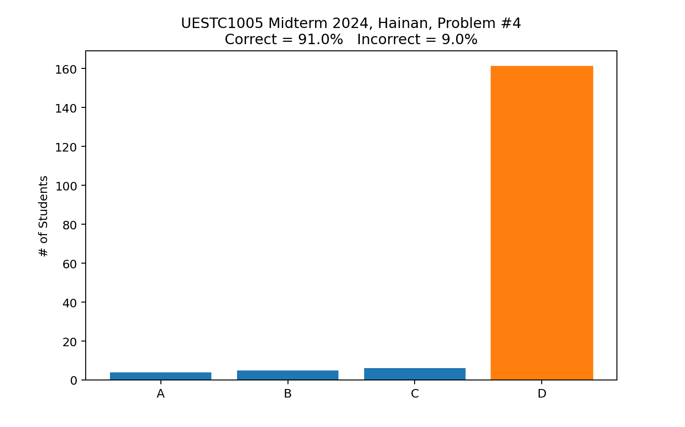

# Midterm Exam: Overall Score Distribution


---

# Midterm Exam: Question #1 Score Distribution


---

# Midterm Exam: Question #2 Score Distribution


---

# Midterm Exam: Question #3 Score Distribution


---

# Midterm Exam: Question #3 Solution


``` C
int main() {
int a = 1;                  // VALID
    int x = 2;int y = 3;    // VALID
    return 0;
}
```

---

# Midterm Exam: Question #4 Score Distribution



---

# Midterm Exam: Question #5 Score Distribution


---

# Midterm Exam: Question #6 Score Distribution


---

# Midterm Exam: Question #6 Solution


- Look closely at the first `if`: `opt = '+'` and NOT `opt == '+'`
- In C (and many programming languages), the *value* of the assignment operator `=` is equal to the assigned value.
- Why? So you can chain assignments, e.g., `x = y = 10;`
- So, the value of `opt = '+'` is nonzero, i.e., logical *true*.

---

# Midterm Exam: Question #7 Score Distribution


---

# Midterm Exam: Question #8 Score Distribution


---

# Midterm Exam: Question #9 Score Distribution


---

# Midterm Exam: Question #10 Score Distribution


---


# "...investigations revealed that even in such technical lines as engineering, about 15 percent of one’s financial success is due to one’s technical knowledge and about 85 percent is due to skill in human engineering &mdash; to personality and the ability to lead people."

## &mdash; Dale Carnegie, *How to Win Friends and Influence People*, 1936

---

<!-- _header:  -->

# UESTC 1005 — Introductory Programming

<h2>Lecture 11 &mdash; Structures and Bit Manipulation</h2>

Dr. Mark D. Butala

<!-- transition: fade -->
<!-- <style scoped>a { color: #eee; }</style> -->

<!-- This is presenter note. You can write down notes through HTML comment. -->

<style scoped>
    .team-table {
        .bottom: 1%;
    }
</style>

<div align="center">
<p style="margin-bottom:0.5cm;">

| Chengdu Team | Hainan Team |
|--------------|-------------|
| Dr. Syed M. Raza | Dr. Mark D. Butala |
| Dr. Ahmad Zoha | Prof. Bo Liu |
| Dr. Hassan T. Abbas | Prof. Chong Li |

</p>
</div>

---

# Recap: Pass by Value ⩇⩇:⩇⩇ vs. by Reference 👉(⩇⩇:⩇⩇)

``` C
#include <stdio.h>

double div2_pass_by_value(double x) {
    return x / 2;
}


double div2_pass_by_reference(double *x_ptr) {
    double x = *x_ptr;  // store the value pointed to by x_ptr to x
    *x_ptr = x / 2;     // store the value of x/2 to the addresses pointed to by x_ptr
    return *x_ptr;      // return the value of x_ptr
}

int main() {
    double a = 20;
    double b = div2_pass_by_value(a);
    printf("a=%5.1lf  b=%5.1lf\n", a, b);   // a= 20.0  b= 10.0
    a = div2_pass_by_reference(&b);
    printf("a=%5.1lf  b=%5.1lf\n", a, b);   // a=  5.0  b=  5.0
    return 0;
}
```

---

# C Functions with Multiple Outputs

- In C, a function may accept multiple inputs but may only return *one* value 💃
- What to do when you would like to return multiple values 💃🏻🕺🏽?

## Option 1: Pass Output Variables by Reference

``` C
void min_max_call_by_ref(int *min, int *max, int *a, unsigned length) {
    // Find the minimum and maximum value found in an array
    // Input parameters: a, length
    // Output parameters: min, max
    *min = INT_MAX;
    *max = INT_MIN;
    for (unsigned i = 0; i < length; i++) {
        if (a[i] < *min) {*min = a[i];}
        if (a[i] > *max) {*max = a[i];}
    }
}
```

---

# C Functions with Multiple Outputs

## Option 2: Return a Structure Variable

``` C
struct MinMax {
    int min;
    int max;
};

struct MinMax min_max_by_struct(int *a, unsigned length) {
    // Find the minimum and maximum value found in an array
    struct MinMax tuple = {INT_MAX, INT_MIN};
    for (unsigned i = 0; i < length; i++) {
        if (a[i] < tuple.min) {tuple.min = a[i];}
        if (a[i] > tuple.max) {tuple.max = a[i];}
    }
    return tuple;
}
```

---

# You Should (Probably) Always Pass Structure Variables by Reference

- Passing a structure variable to a function will be *by value* ⩇⩇:⩇⩇
- Recall: a copy of a variable is created when passed by value ⩇⩇:⩇⩇+⩇⩇:⩇⩇
## Disadvantages of passing by value:
  - Memory requirement is doubled
  - CPU time 💻 to perform the copy
##  Advantage of passing by value:
  - May provide some protection 😷: modification of the copied value in function does not affect the variable passed to the function

---

# The `const` Type Qualifier

- A `const` 🔒 variable informs that compiler that the variable is *read-only*
- Modification of a `const` variable results in a compile-time error

``` C
int main() {
    int x = 10;
    const int y = x;
    y = 0;             // ERROR
    // error: cannot assign to variable 'y' with const-qualified type 'const int'
    int *y_ptr = &y;   // WARNING
    // warning: initializing 'int *' with an expression of type 'const int *' discards qualifiers
    *y_ptr = 0;        // UNDEFINED BEHAVIOR!
    return 0;
}}
```

---

# Balance ⚖️: Pass by Reference Via `const` Pointer

- Using `const`, you can pass a variable by reference to a function and guarantee that the function cannot modify the variable's value 😷
``` C
void min_max_call_by_ref(int *min, int *max, const int *a, unsigned length) {
    // Find the minimum and maximum value found in an array
    // Input parameters: a, length
    // Output parameters: min, max
    *min = INT_MAX;
    *max = INT_MIN;
    for (unsigned i = 0; i < length; i++) {
        if (a[i] < *min) {*min = a[i];}
        if (a[i] > *max) {*max = a[i];}
    }
}
```
- You can have your cake 🍰 and eat it too 😋!

---

# <!--fit--> <span style="color:white"> Bit Manipulation</span>


---
