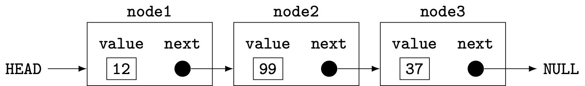
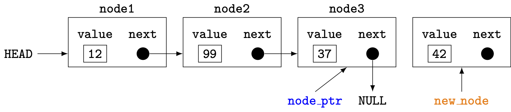
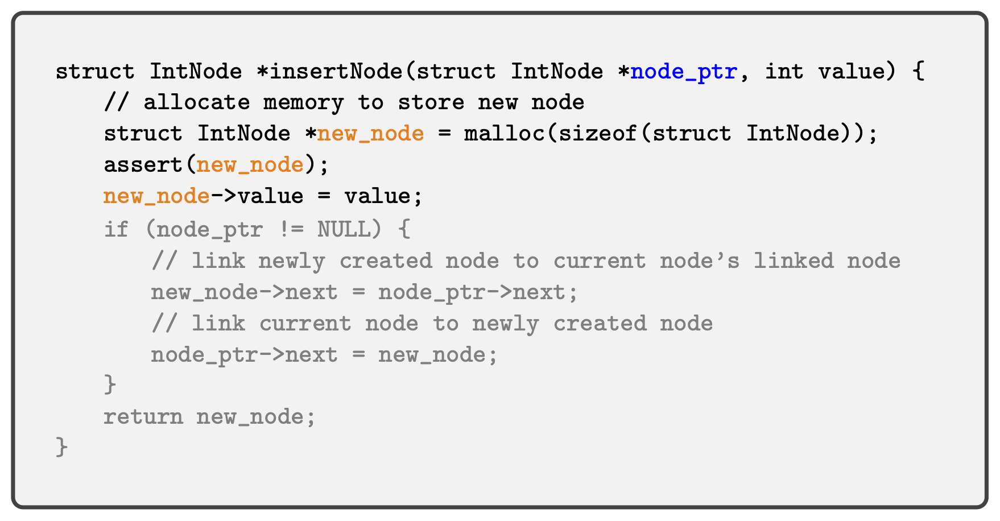
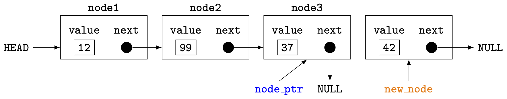
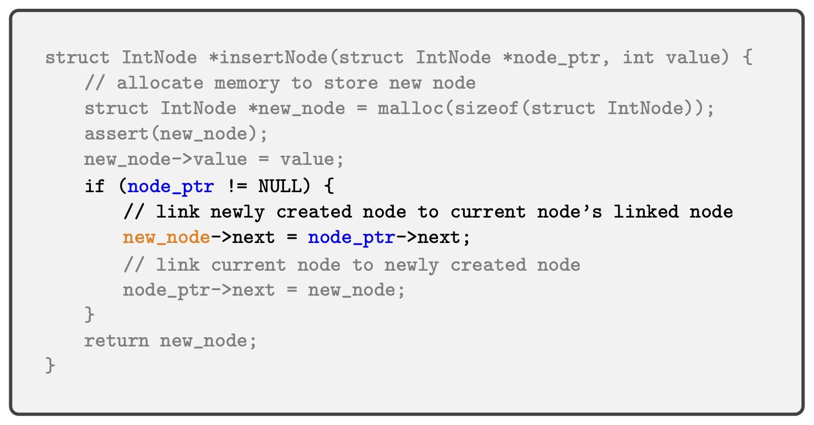
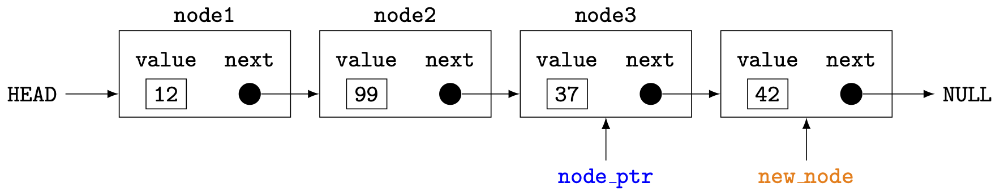
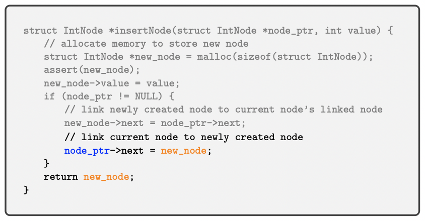

<!--  -->

<!-- # "Strive for perfection in everything you do. Take the best that exists and make it better. When it does not exist, design it." -->

<!-- ## &mdash; Sir Henry Royce  🚗✈️ -->


<div class="columns">

<div>

# "Strive for perfection in everything you do. Take the best that exists and make it better. When it does not exist, design it."
## &mdash; Sir Henry Royce  🚗✈️

</div>

<div>


</div>

</div>

---

<!-- _header:  -->

# UESTC 1005 — Introductory Programming

<h2>Lecture 12 &mdash; File I/O and Linked Lists</h2>

Dr. Mark D. Butala

<!-- transition: fade -->
<!-- <style scoped>a { color: #eee; }</style> -->

<!-- This is presenter note. You can write down notes through HTML comment. -->

<style scoped>
    .team-table {
        .bottom: 1%;
    }
</style>

<div align="center">
<p style="margin-bottom:0.5cm;">

| Chengdu Team | Hainan Team |
|--------------|-------------|
| Dr. Syed M. Raza | Dr. Mark D. Butala |
| Dr. Ahmad Zoha | Prof. Bo Liu |
| Dr. Hassan T. Abbas | Prof. Chong Li |

</p>
</div>

---

# Questions 🙋❓

- Ask me anything (programming-related 😎)

---

# Lecture Outline

- File 💾📀💽 input and output
- Linked lists  ...⫘📦⫘📦⫘📦⫘📦⫘📦⫘...
- Bubble sort 🫧

---

# Background: Some UNIX philosophy 🧐🏛🎓

- Influential contribution: "stream of bytes" abstraction for all input and output devices
- History of UNIX and C are closely intertwined 🪢🖇️💞 &mdash; C (and most other programming languages) use the "stream of bytes" style
- Example input ("source") devices:
  + Keyboard ⌨️, mouse 🖱️, game controller 🎮, microphone 🎙️
  + Disk 💾
  + Network 📡
- Example output ("sink") devices:
  + Monitor 🖥️, printer 🖨️, speaker 🔊
  + Disk 💾
  + Network 📡


---

# The standard text streams in `stdio.h`

- Three text streams are *implicitly* (behind the scenes magic 🪄✨) opened before the execution of `main` and closed after its completion:
  + `stdin`: the standard input stream (usually the keyboard ⌨️)
  + `stdout`: the standard output stream (usually the monitor 🖥️)
  + `stderr`: the standard error stream intended for diagnostic output (usually the monitor 🖥️ but also useful if set to a file 💾)
- A text (binary) stream is a sequence of `char`s (bytes)
- Streams are of type `FILE *`, i.e., a pointer to the stream state
- In UNIX/C, (practically) all streams are files and (practically) all files are streams


---

# How to open a file for input or output

- File open: `FILE *fopen(const char *filename, const char *mode)`
- The string *mode* specifies the file access mode:

| `mode` | Meaning | Description              | Action file exists  | Action if file does not exist |
|--------|---------|--------------------------|---------------------|-------------------------------|
| `"r"`  | read    | Open a file for input    | Read from beginning | Return `NULL`                 |
| `"w"`  | write   | Create a file for output | Overwrite file      | Create new file               |
| `"a"`  | append  | Output to end of file    | Write at end        | Create new file               |

- Return value is `NULL` if there was an error to access the file

---

# How to close 🚪 a stream

- File close: `int fclose(FILE *stream)`
- Return `0` on success
- Tidy your mess 🧹💩, i.e., every `fopen` should be paired with an `fclose` because there is an OS limit on the number of open files


---

# How to flush 🚽 a stream

- File flush (write unwritten data stored in buffer): `int fflush(FILE *stream)`
- Only for output streams &mdash; return `0` on success
- For performance, files/streams are (usually) *buffered* and input/output occurs on blocks (array of bytes) rather than bytes
- Notable unbuffered stream: `stderr`
- ❗⚠️: `stdout` is buffered and output may "disappear" when a program crashes

---

# Reading data from a file

<div class="columns">

<div>

- Simple program to read contents of `test.txt` and print to the screen:

```C
#include <stdio.h>
#include <assert.h>
#define BUFFER 1024

int main() {
    FILE *input_file = fopen("test.txt", "r");
    assert(input_file);  // make sure file was opened

    int integer; char c; char string[BUFFER]; float pi;

    fscanf(input_file, "%d", &integer);
    fgetc(input_file);  // skip space character ' '
    c = fgetc(input_file); // read character after the space
    fgetc(input_file);  // skip newline character '\n'
    fgets(string, BUFFER, input_file);
    fscanf(input_file, "%f", &pi);

    printf("integer=%d c=%c string=\"%s\" pi=%f\n",
           integer, c, string, pi);

    fclose(input_file);
    return 0;
```

</div>

<div>

- Suppose `test.txt` contains:
```
42 !
I am a string
3.14159
```

- Output:

```
integer=42 c=! string="I am a string
" pi=3.141590
```

- Note that `fgets` includes the newline character `\n`

</div>


---

# Calculate average of scores stored in a file

``` c
#include <stdio.h>
#include <assert.h>

int main() {
    unsigned N = 0, score, total = 0;
    FILE *fptr = fopen("scores.txt", "r");
    assert(fptr);
    // feof returns non-zero when the end of the file has
    // been reached
    while (!feof(fptr)) {
        fscanf(fptr, "%u", &score);
        total += score;
        N++;
    }
    printf("Average = %.2lf%%\n", (double) total / N);
    fclose(fptr);
    return 0;
}
```

---

# Write pagoda (塔) art to a file (or to the screen)

``` c
#include <stdio.h>
#include <stdlib.h>
#include <assert.h>
// begin magic :)
// Adapted from https://codegolf.stackexchange.com/questions/50625/ascii-art-of-the-day-3-chinese-shrines
// THIS IS AWFUL CODE --- DON'T WRITE CODE LIKE THIS!  My eyes feel like they are bleeding!
// This code has been written for "code golf" 🏌⛳, a competition where the shortest code wins
int d,i,w;  char s[1<<24];  FILE *FPTR = NULL;
int v(int i, int j){s[w-i]=".|]\\#/"[j%7];s[w+i]=".|[/#\\"[j%7]; while(i--)s[w-i]=s[w+i]="# _-"[j/7];return 0;}
int m(int _){return v(w,13);}
int p(int _){fputs(s+1, FPTR);return fputc('\n',FPTR);}
void shrine(int l){d=l>3?3:l;m(w=l*2+6);p(v(0,0));
    for(v(0,1);i++<=l;v(i*2+2,17))p(0),v(i*2+3,7),m(p(v(i,2)));v(l+2,2);p(v(d,21));
    for(m(i=w-3);i>d+1;i-=3)v(i,15);p(v(d,8));p(v(d,15));v(w-3,4);m(p(v(d,19)));p(v(d+1,15));p(v(d+2,19));}
// end magic :)

int main(int argc, char const *argv[]) {
    switch (argc) {
        case 2: FPTR = stdout; break;
        case 3: FPTR = fopen(argv[2], "w"); break;
        default: printf("Usage: %s <size> [<filename>]\n", argv[0]); assert(0);
    }
    assert(FPTR);
    int n = atoi(argv[1]);
    shrine(n);
    fclose(FPTR);
    return 0;
}
```

---

# Write pagoda (塔) art to a file (or to the screen)

- Suppose the former program is compiled and run as `./pagoda 6 pagoda.txt`
- Contents of `pagoda.txt`:

<style scoped>
    pre {
        font-size: 12px;
    }
</style>

```
                 .
                 |
            .   ]#[   .
             \_______/
          .    ]###[    .
           \___________/
        .     ]#####[     .
         \_______________/
      .      ]#######[      .
       \___________________/
    .       ]#########[       .
     \_______________________/
  .        ]###########[        .
   \___________________________/
.         ]#############[         .
 \_______]####.-----.####[_______/
  |__|__|__|__|     |__|__|__|__|
  |__|__|__|__|_____|__|__|__|__|
  ############/_____\############
             |_______|
            /_________\
```

- Running as `./pagoda 6` produces the same output on the screen

---


# Summary of standard input/output functions 📝

<div align="center">


| Function           | Description                       |
|--------------------|-----------------------------------|
| `fopen`/`fclose`   | Open/close a file                 |
| `fflush`           | Flush output stream               |
| `feof`             | Has the end-of-file been reached? |
| `fgetc`/`fputc`    | Read/write a `char`               |
| `fgets`/`fputs`    | Read/write a string               |
| `fscanf`/`fprintf` | Formatted read/write              |

</div>

- `printf(...)` and `scanf(...)` are equivalent to `fprintf(stdout, ...)` and `fscanf(stdin, ...)`, respectively

</div>


---

# <!--fit--> <span style="color:white">Linked Lists</span>


---

# What is the purpose of a linked list? 🤔

- An array stores a *fixed* number of elements of the same type
- Potential issues with arrays: what if
  - the array size is unknown at compile-time?
  - the array size needs to change over time?
  - an element must be inserted or removed?
- Potential solution: `malloc` / `free` and copy array contents as necessary
  - But this can be computationally wasteful! 🚮

---

# Nodes 📦 and links 🔗

- A linked list *node* stores two things:
  - A value
  - A pointer (the link) to the next node in the linked list
- Example definition of a node:
``` c
struct IntNode {
    int value;
    struct IntNode *next;
}
```

---

# Example definition of a linked list

<style scoped>
    pre {
        font-size: 18px;
    }
</style>


<div align="center">



</div>

``` c
#include <stdio.h>
#include <stdlib.h>

struct IntNode {
  int value;
  struct IntNode *next;
};

int main() {
  struct IntNode node1 = {12, NULL};
  struct IntNode node2 = {99, NULL};
  struct IntNode node3 = {37, NULL};
  node1.next = &node2;
  node2.next = &node3;
  struct IntNode *HEAD = &node1;

  return 0;
}
```

</div>

---

# Example of linked list traversal 🚶‍♂️🚶‍♂️🚶‍♂️

<style scoped>
    pre {
        font-size: 18px;
    }
</style>


- Example linked list:

<div align="center">


</div>

- Code to traverse (walk across) the linked list values:

``` c
// for loop to traverse the linked list
for (const struct IntNode *ptr = HEAD; ptr != NULL; ptr = ptr->next) {
    printf("%d\n", ptr->value);
}
```

- Output:

```
12
99
37
```

---

# Linked list node insertion  📦⫘📦⫘📦 + 🎁

- Nodes can be easily inserted into a linked list 🏅
- Declaration of the insert function:
  - `node_ptr`: list node to insert a new link in the chain
  - `value`: data to store in the new node
  - The function returns a pointer to the new list node
``` c
struct IntNode *insertNode(struct IntNode *node_ptr, int value)
```
- Common insertion points:
  - `node_ptr = HEAD`: insert at the beginning
  - `node_ptr = TAIL`: insert at the end

---

# Linked list node insertion: 1) memory allocation

<div align="center">



</div>


<div align="center">



</div>


---

# Linked list node insertion: 2) assign `new_node` link

<div align="center">



</div>


<div align="center">



</div>


---

# Linked list node insertion: 3) assign `node_ptr` link

<div align="center">



</div>


<div align="center">



</div>


---

# Linked list node insertion: example

- Recreation of "Example definition of linked list" using `insertNode`:

``` c
int main() {
    struct IntNode *HEAD = NULL, *TAIL = NULL, *node99 = NULL;

    HEAD = TAIL = insertNode(NULL, 12);
    node99 = TAIL = insertNode(TAIL, 99);
    TAIL = insertNode(TAIL, 37);
    TAIL = insertNode(TAIL, 42);

    printfLL(HEAD);                    // output: 12 99 37 42
    insertNode(node99, -1);
    printfLL(HEAD);                    // output: 12 99 -1 37 42

    return 0;
}
```

- How would you implement `printLL`?

---

# Remember to tidy your mess! ♻️🚮🧹
- The `insertNode` function uses `malloc` &mdash; every `malloc` must have a corresponding call to `free`

``` c
void freeLL(struct IntNode **node_ptr_ptr) {
    struct IntNode *node_ptr = *node_ptr_ptr;
    while (node_ptr != NULL) {
        struct IntNode *next_node_ptr = node_ptr->next;
        free(node_ptr);
        node_ptr = next_node_ptr;
    }
    *node_ptr_ptr = NULL;
}
```
- The function takes a `struct IntNode **` as input, i.e., a *pointer to a pointer* 🤯
- The final line `*node_ptr_ptr = NULL;` assigns the input pointer to `NULL`

---

# The linked list data structure  📐👷🏻‍️🏗️
- A *data structure* builds upon simple, primitive data types (e.g., integer, floating point number, string)
- The goal 🎯: clear and clean data representation and programming interface:
  + Retrieve list element value
  + Append to end of list
  + Insert / delete list element
  + Join two lists
  + Free allocated memory
- Frees the programmer to focus on higher level tasks 🚀


---

# Brief introduction to "big $O$ notation"

- How does run-time ⏰ or memory usage 💾 scale as the input size becomes "large"?
- Provides a way to compare and contrast different data structure and algorithms

<div align="center">


</div>

---

# Dynamic array implementation performance

- A dynamic array is an *abstract data type* that supports variable size, random access, and element insertion/deletion

|             | Index  | Mutate beginning / end | Mutate middle | Excess space (average) |
|-------------|--------|------------------------|---------------|------------------------|
| Array       | $O(1)$ | $O(n)$                 | $O(n)$        | 0                      |
| Linked list | $O(n)$ | $O(1)$                 | $O(n)$        | $O(n)$                 |

- Index: get or set the $n$ th element
- Mutate: insert/delete element to/from dynamic array
- Excess space: memory overhead (storing `next` for linked list)


---

# <!--fit--> <span style="color:white">Bubble Sort: A simple sorting algorithm</span>


---

# Bubble sort 🫧

<div align="center">


(https://en.wikipedia.org/wiki/Bubble_sort)

</div>

- In bubble sort, small values "bubble" to the top and large values "sink" to the bottom
- The algorithm: set `i=0` and `N_i = N - 1` where `N` is the length of the list
  + If `value[i]` is greater than `value[i+1]` then swap the values
  + Increment `i++` and stop when `i > N_i - 1`
- The largest value encounterd will now appear at index `N_i`
- Set `i=0`, decrement `N_i--`, and repeat until no swap occurs

---

# Bubble sort implementation 👨‍💻

``` c
void sortLL(struct IntNode *head, unsigned int length) {
    assert(head != NULL);
    int swap_occurred;
    unsigned int N_i = length;
    do {
        swap_occurred = 0;
        struct IntNode *node = head;
        for (unsigned int i = 0; i < N_i - 1; i++, node = node->next) {
            if (node->value > node->next->value) {
                swapInt(&node->value, &node->next->value);
                swap_occurred = 1;
            }
        }
        N_i--;
    } while (swap_occurred);
}
```

---

# Bubble sort performance

- Bubble sort is said to have $O(N^2)$ complexity
  + For each element in the list, do operations on the remaining elements
  + Double the list length and bubble sort takes $4\times$ as long ⏱😬
- More complex sorting algorithms, e.g., quicksort, have $O(N \log N)$ performance
- Donald Knuth, *The Art of Computer Programming*, "the bubble sort seems to have nothing to recommend it, except a catchy name and the fact that it leads to some interesting theoretical problems" 🔥🤣

---

# Next Up ⏭️

- Tutorial  👨‍🏫
- Exam preparation  🖊️📖✏️📚
- Bring questions 🤔💭 and get answers 🤩!
