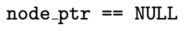
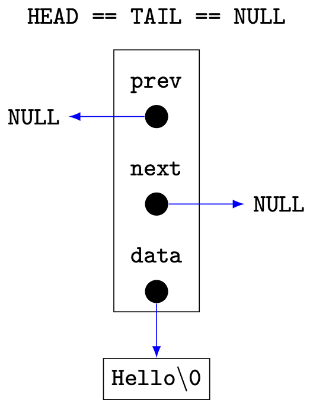
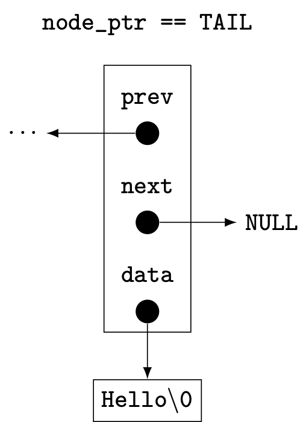
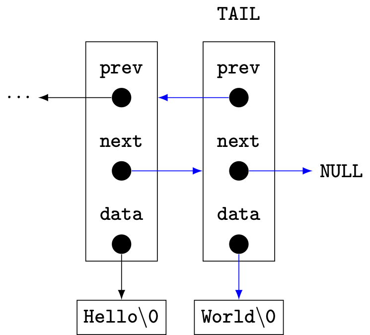
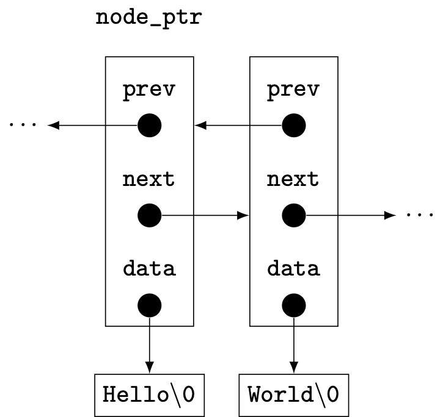
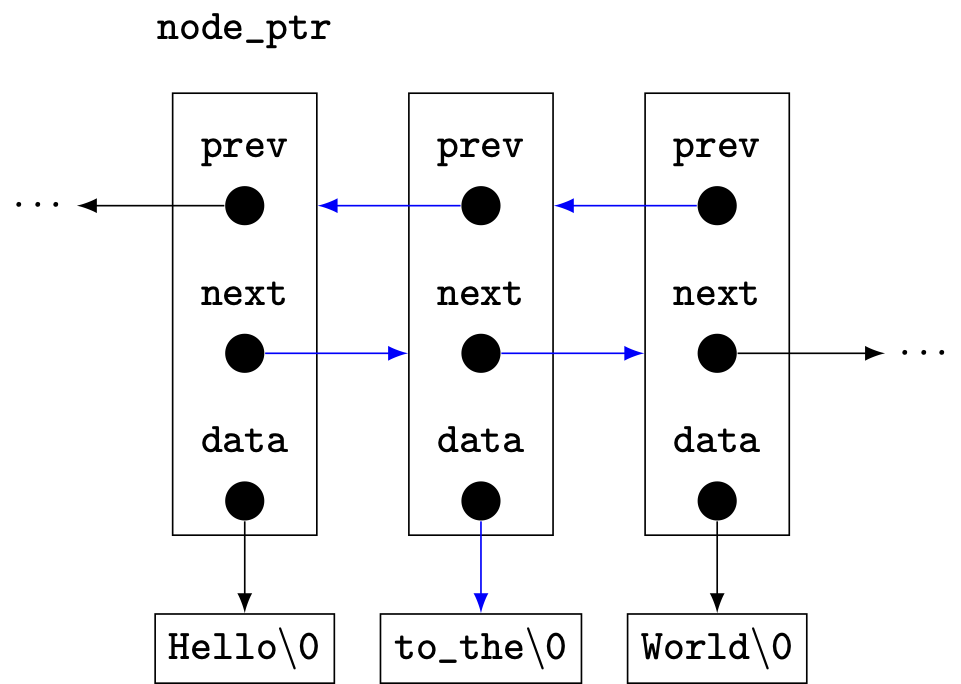

<div style="width: 64%; float:left">

#
#
#
# 🧽 ABSORB what is useful,
# 🗑️ DISCARD what is not,
# ➕ ADD what is uniquely your own
## &mdash; 李小龍

</div>

<div style="width: 30%; float:right">


</div>


---

<!-- _header:  -->

# UESTC 1005 — Introductory Programming

<h2>Lecture 13 &mdash; Double Pointers, Doubly Linked List, Binary Search</h2>

Dr. Mark D. Butala

<!-- transition: fade -->
<!-- <style scoped>a { color: #eee; }</style> -->

<!-- This is presenter note. You can write down notes through HTML comment. -->

<style scoped>
    .team-table {
        .bottom: 1%;
    }
</style>

<div align="center">
<p style="margin-bottom:0.5cm;">

| Chengdu Team | Hainan Team |
|--------------|-------------|
| Dr. Syed M. Raza | Dr. Mark D. Butala |
| Dr. Ahmad Zoha | Prof. Bo Liu |
| Dr. Hassan T. Abbas | Prof. Chong Li |

</p>
</div>


---

# Lecture Outline

- Double pointers ✨✨
- Doubly linked list   ...↔️📦↔️📦↔️📦↔️📦↔️📦↔️...
- Binary search  🔟🔎
- Exam recommendations 💡

---

# Recap of pointers

- In the scope of IP, we have used pointers ╰┈➤ in the following ways:
  + To pass a variable to a function by reference
  + Equivalence (in most cases): array variable name and pointer to first element
  + For dynamic memory allocation
  + To store the link to the next node in a linked list
- Of these, passing a variable by reference is the most common case

---

# What is a pointer to a pointer?!? 🤯

- Understand this, and you understand pointers (and call by reference) 👩🏻‍🎓👨🏻‍🎓
- Recall: a variable passed by reference can be modified by the function
- Passing a pointer variable by reference "gives permission" to the function to modify the pointer
- A reference to a pointer (`&x_ptr` where `x_ptr` is a pointer) is a pointer to a pointer
- What's the point 😜? 👉 double pointers occur when you pass a pointer variable by reference to a function

---

# Double pointer example: `longer_string` function

``` c
// c_ptr_ptr is a pointer, to a pointer, to a char
unsigned longer_string(char **c_ptr_ptr, char s1[], char *s2) {
    // Compare the lengths of strings s1 and s2. Assign the pointer
    // passed by reference (c_ptr_pttr) to the longer string and
    // return the length of the longer string.
    unsigned N1 = strlen(s1);
    unsigned N2 = strlen(s2);
    if (N2 > N1) {
        *c_ptr_ptr = s2;
        return N2;
    }
    else {
        *c_ptr_ptr = s1;
        return N1;
    }
}
```

---

# Double pointer example: `main`

``` c
#include <stdio.h>
#include <string.h>

// c_ptr_ptr is a pointer, to a pointer, to a char
unsigned longer_string(char **c_ptr_ptr, char s1[], char *s2) {
    // See impplementation on previous slide
}

int main(void) {
    char *string1  = "Hello World";
    char string2[] = "IP rulz!";
    char *c_ptr = NULL;

    unsigned N = longer_string(&c_ptr, string1, string2);
    printf("The longer string is \"%s\" which has a length of %u\n", c_ptr, N);
    // Output: The longer string is "Hello World" which has a length of 11

    return 0;
}
```


---


# <!--fit--> <span style="color:white">Doubly Linked List</span>


---

# Doubly linked lists: the what 🤔 and why 🤩

- So far we have covered *singly* linked lists
  + Each node stores the pointer to the next node to right ... ➡️ 📦 ➡️ 📦 ➡️ ...
  + Supports traversal from list beginning (`HEAD`) to end (`TAIL`)

- Let us add a link to the previous node to each node ... ↔️ 📦 ↔️ 📦 ↔️ ...
``` c
struct PersonNode {
    char name[41];
    unsigned age;
    struct PersonNode *next;
    struct PersonNode *prev;
}
```

- Enables forward and backwards traversal (and added memory overhead)

---

# Reverse traversal example

``` c
#include <stdlib.h>
#include <stdio.h>

int main() {
    struct PersonNode {
        char name[41];
        unsigned age;
        struct PersonNode *next;
        struct PersonNode *prev;
    };

    struct PersonNode taichonaut1 = {"Yang Liwei", 59, NULL, NULL};
    struct PersonNode taichonaut2 = {"Fei Junlong", 59, NULL, NULL};
    struct PersonNode taichonaut3 = {"Liu Yang", 46, NULL, NULL};

    struct PersonNode *HEAD = &taichonaut1;
    taichonaut1.next = &taichonaut2; taichonaut2.next = &taichonaut3;
    taichonaut3.prev = &taichonaut2; taichonaut2.prev = &taichonaut1;
    struct PersonNode *TAIL = &taichonaut3;

    for (struct PersonNode *node = TAIL; node != NULL; node = node->prev) {
        printf("%s (%d)  ", node->name, node->age);
    }
    // Output: Liu Yang (46)  Fei Junlong (59)  Yang Liwei (59)

    return 0;
}
```

---

# Doubly linked list insertion

- Recall `insertNode` for a singly linked list was fairly complex 😵‍💫
- Added complexity for a doubly linked list: `next` and `prev` member updates
- Let us consider doubly linked list `insertNodeRight` (insert to right of given node)
- For added challenge 🏋️, consider nodes with dynamically allocated data:

``` c
struct StringNode {
    char *data;
    struct StringNode *next;
    struct StringNode *prev;
};


struct StringNode *insertNodeRight(struct StringNode *node_ptr, const char *str) {
    // We will consider the code implementation after a few more slides
}
```

---

# Case 1: `insertNodeRight` to empty list

`HEAD = TAIL = insertNodeRight(NULL, "Hello");`

<div class="columns">

<div>

## Before call



</div>

<div>

## After call



</div>

</div>

---

# Case 2: `insertNodeRight` to `TAIL` of list

`TAIL = insertNodeRight(TAIL, "World");`

<div class="columns">

<div>

## Before call



</div>

<div>

## After call



</div>

</div>


---

# Case 3: `insertNodeRight` general case

`insertNodeRight(node_ptr, "to_the");`

<div class="columns">

<div>

## Before call



</div>

<div>

## After call



</div>

</div>


---

# Doubly linked list insertion implementation 🛠️

``` c
struct StringNode *insertNodeRight(struct StringNode *node_ptr, const char *str) {
    struct StringNode *new_node = malloc(sizeof(struct StringNode));  // allocate memory to store new node
    assert(new_node);
    new_node->data = malloc(sizeof(char) * (strlen(str) + 1));
    assert(new_node->data);
    strcpy(new_node->data, str);
    if (node_ptr != NULL) {
        // link newly created node to current node's linked node
        new_node->next = node_ptr->next;
        new_node->prev = node_ptr;
        // link current node to newly created node
        node_ptr->next = new_node;
        // link next node back to newly created node
        if (new_node->next != NULL) {
            new_node->next->prev = new_node;
        }
    }
    return new_node;
}
```

- There is a LOT happening in the above code
- We would NEVER expect you to write code of this complexity 🧬 in an exam ✍📝

---

# Tidying up `StringNode`-based linked list

- There are two `malloc`s in `insertNodeRight` to allocate memory for:
  + The `data` member
  + The newly created `StringNode`

``` c
void freeLL(struct StringNode **node_ptr_ptr) {
    struct StringNode *node_ptr = *node_ptr_ptr;
    while (node_ptr != NULL) {
        struct StringNode *next_node_ptr = node_ptr->next;
        // free the memory reserved for data member (the string)
        free(node_ptr->data);
        // free the memory reserved for the node
        free(node_ptr);
        node_ptr = next_node_ptr;
    }
    *node_ptr_ptr = NULL;
}
```

---

# A `StringNode` doubly linked list in action 🎬

``` c
int main() {
    struct StringNode *HEAD = NULL, *TAIL = NULL;

    HEAD = TAIL = insertNodeRight(NULL, "Hello");
    TAIL = insertNodeRight(TAIL, "World");
    insertNodeRight(HEAD, "to_the");
    HEAD = insertNodeLeft(HEAD, "Yo,");  // HW problem! Can you write this code?

    printfLL(HEAD);   // Output: Yo, Hello to_the World
    rprintfLL(TAIL);  // Output: World to_the Hello Yo,

    printf("HEAD == NULL? %d\n", HEAD == NULL);  // Output: HEAD == NULL? 0
    freeLL(&HEAD);                               // tidy our mess
    printf("HEAD == NULL? %d\n", HEAD == NULL);  // Output: HEAD == NULL? 1
    // HEAD was passed by reference to freeLL and assigned to NULL
    TAIL = NULL;

    return 0;
}
```

---

# <!--fit--> <span style="color:white">Binary Search</span>


---

#  Typical beginner 🐣 programmer progression

1. Learn a programming language
2. Learn data structures
3. Learn search and sort algorithms

### Search algorithms are used everywhere 🌎, all the time 🔁🔁🔁!

<div align="center">


</div>

---

# Linear search

- The simplest search: is a given value in an array?
``` c
int *linear_search(int *array, unsigned length, int search_value) {
    for (unsigned i = 0; i < length; i++) {
        if (array[i] == search_value) {
            return &array[i];
        }
    }
    return NULL;
}
```
- This a *linear* search algorithm because it requires, on average, $O(n)$ operations to complete the search


---


# Binary search

- If the array is sorted, then it is possible to do much better, $O(\log n)$ operations

<div align="center">


(https://en.wikipedia.org/wiki/Binary_search)

</div>

- This is an example of a divide ÷ and conquer 💪 algorithm (分治法)

---

# The `bsearch` function

- The C standard library provides a binary search function `bsearch` in `stdlib.h`
- You must provide a *pointer to a function* 🤯🤯🤯 to use `bsearch`
  + Functions pointers are beyond the scope of IP
- Though it appears simple, it is challenging to write a correct binary search function
- I would always use a binary search function from a robust software library

---

<div style="width: 45%; float:left">

## "Although the basic idea of binary search is comparatively straightforward, the details can be surprisingly tricky"
## Donald Knuth, *The Art of Computer Programming*

</div>

<div style="width: 50%; float:right">


</div>

---

# Binary search: key points 🎯

- What we expect IP students to know:
  + Sort is an $O(n \log n)$ algorithm
  + Search on a *sorted* sequence is $O(\log n)$
  + If you need to search many times, first sort the sequence and then binary search

---

# <!--fit--> <span style="color:white">Exam Recommendations</span>


---

# Typos vs. logical errors

- YES, you will be asked to handwrite ✍ code on the final exam 😬
- You (and I) are not a computer 💻 or compiler 🤖
- Small syntax mistakes will result in few (or no) loss of marks

``` c
#include < stdio >
int main() {
   fputs(stdout, "Hello world!")
}
```

<div align="center">

(can you find all 4 errors?)

</div>

- *Logic* mistakes will result in some (or all) loss of marks

``` c
int x;
scanf("%d", x);
```

---

# Overall recommendations

- Use past exams to practice
- The final exam is comprehensive
- Comment your code
- Leave *nothing* blank
  + A question with an empty response will earn 0 marks
  + Correct pseudo-code (outline of the code steps) will earn partial marks

---

🍀🤞🍀🤞🍀🤞🍀🤞🍀🤞🍀🤞🍀🤞🍀🤞🍀🤞🍀🤞🍀🤞🍀🤞🍀🤞🍀🤞🍀🤞🍀🤞🍀🤞🍀🤞🍀🤞🍀🤞🍀🤞🍀🤞🍀🤞🍀🤞🍀🤞🍀🤞🍀🤞🍀🤞🍀🤞🍀🤞🍀🤞🍀🤞🍀🤞🍀🤞🍀🤞🍀🤞🍀🤞🍀🤞🍀🤞🍀🤞🍀🤞🍀🤞🍀🤞🍀🤞🍀🤞🍀🤞🍀🤞🍀🤞🍀🤞🍀

<div align="center">

#
# 祝你学业成功
# 祝你金榜题名
#

</div>

🧧🧧🧧🧧🧧🧧🧧🧧🧧🧧🧧🧧🧧🧧🧧🧧🧧🧧🧧🧧🧧🧧🧧🧧🧧🧧🧧🧧🧧🧧🧧🧧🧧🧧🧧🧧🧧🧧🧧🧧🧧🧧🧧🧧🧧🧧🧧🧧🧧🧧🧧🧧🧧🧧🧧🧧🧧🧧🧧🧧🧧🧧🧧🧧🧧🧧🧧🧧🧧🧧🧧🧧🧧🧧🧧🧧🧧🧧🧧🧧🧧🧧🧧🧧🧧🧧🧧🧧🧧🧧🧧🧧🧧🧧🧧🧧🧧🧧🧧
