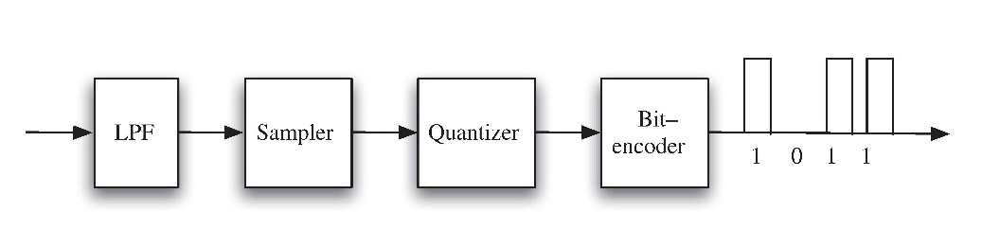
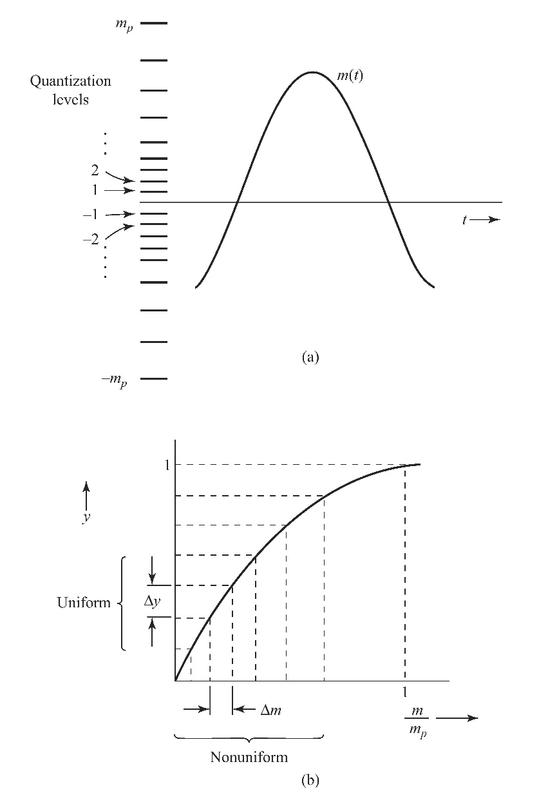
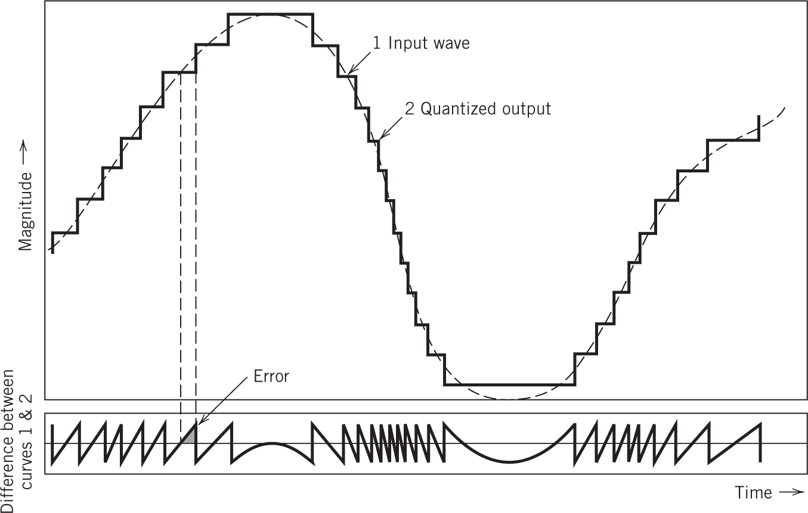
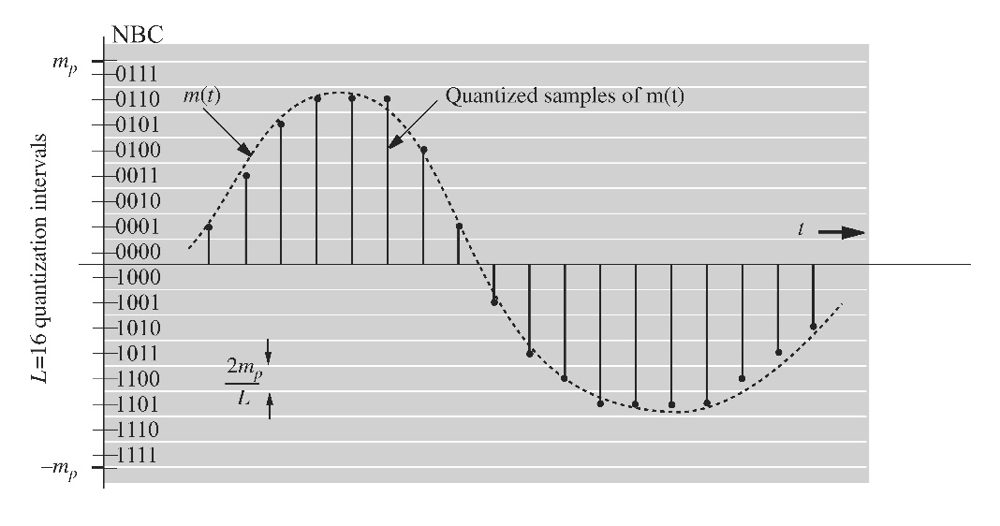
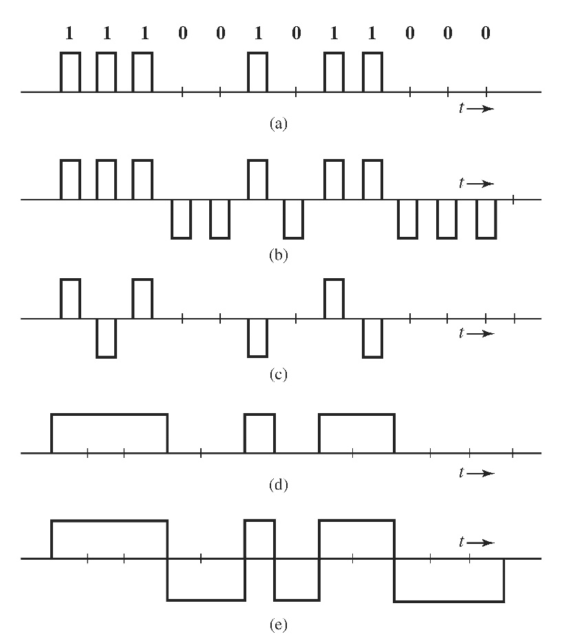
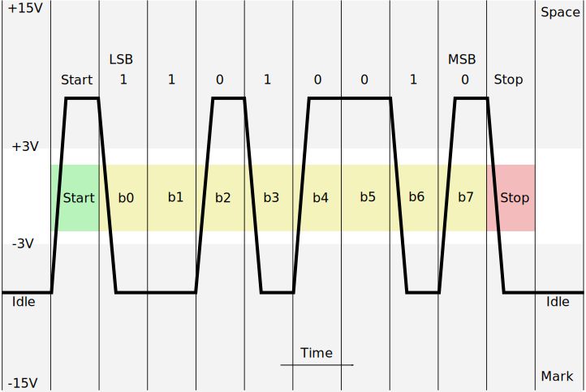
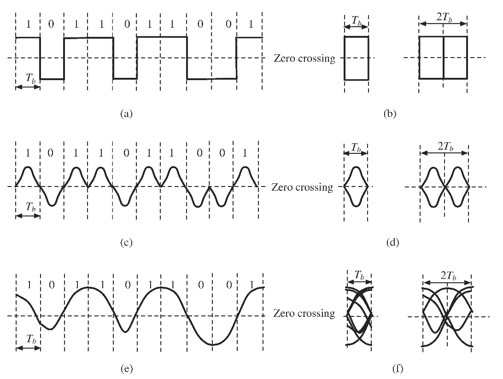
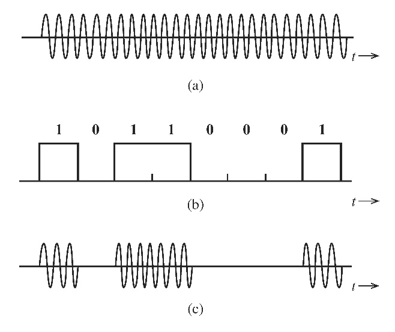
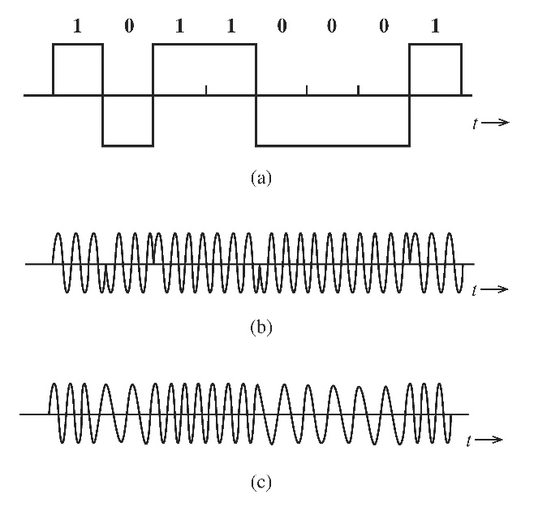
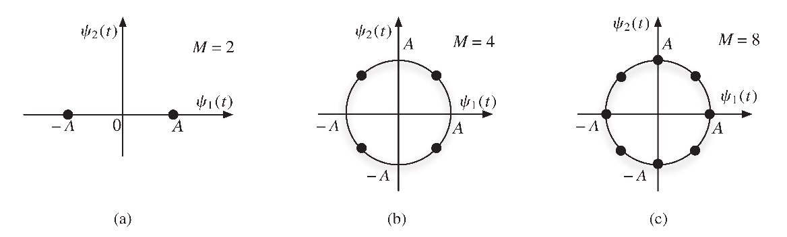

# <!--fit--> <span style="color:white">Quantisation - trading precision for data rate</span>


---

<!-- _header:  -->

# UESTC 3018 — Communication Systems and Principles

Lecture 17 — Quantisation and Equalisation

Dr Hasan Abbas
<!-- transition: fade -->
<!-- <style scoped>a { color: #eee; }</style> -->

<!-- This is presenter note. You can write down notes through HTML comment. -->

---

# From Last Time ⌛

- Sampling
- Pulse Coded Modulation
- Quantisation

---

# Today's Lecture 📆

- Quantisation Error
- Encoding
- Equalisation (if time allows)



---

# Quantisation Types

1. Uniform Quantisation
   - Equal step sizes
   - Simpler implementation
2. Non-Uniform Quantisation
   - Smaller steps for low amplitudes, larger for high amplitudes
   - Improves SQNR for signals with non-uniform distribution



---

# Quantisation Error


<style>
img[alt~="center"] {
  display: block;
  margin: 0 auto;
}
</style>




---

# How is it Found?


- Difference between actual signal and quantised signal
- $q(t) = m(t) - \hat{m}(t)$
  
- The time-averaged power is,

$$
q^2(t) = \lim_{T \to \infty} 1/T \int_{-T/2}^{T/2} \left[ \sum_{k} q(kT_s) \mathrm{sinc} (2 \pi B t - k \pi) \right]^2 dt
$$



---

# Quantisation Noise Calculation (contd.)

- Exploiting orthogonality
- With a sampling rate of $2B$, the total number of samples in an interval $T$ is $2BT$.
- $q(t)$ lies in the $( -m_p/L , m_p/L)$ range
- $q(t)$ is uniformly distributed
- The probability density function (PDF) is constant, i.e.  ($1/(2m_p/L)=L/2m_p$) in the range,

$$
q^2(t) = \int_{-m_p/L}^{-m_p/L} \frac{L}{2m_p} q^2 dq = \frac{m_p^2}{3L^2}
$$

---

# Signal-to-Quantisation Noise Ratio

A measure of the signal quality wrt to the quantisation noise (using power)

$$
  \text{SQNR} = 10 \log_{10} \left( \frac{\text{Signal Power}}{\text{Quantisation Noise Power}} \right)
$$

$$
\frac{S}{N} = 3L^2 \frac{m^2(t)}{m_p^2}
$$

- Strategies to minimise error:
  - Increase bit depth
  - Use non-uniform quantisation


---

# Quantisation Error


<style>
img[alt~="center"] {
  display: block;
  margin: 0 auto;
}
</style>


---

# Example

What bandwidth is needed to transmit a PCM encoded signal?

- Suppose that we want maximum error $0.5\% m_p$ for a 3 kHz signal.

---

# <!--fit--> <span style="color:white">Encoding</span>


---

# Encoding: Line Coding

- Translates bits into physical signals for transmission
- Common techniques:
  - **NRZ** (Non-Return-to-Zero): High for '1', low for '0'
  - **Manchester**: Combines data and clock
  - **RZ** (Return-to-Zero): Short pulses
- Applications:
  - Ethernet, serial communication


---

# Line Coding

- Converts binary data into a digital signal for transmission.
- Ensure compatibility with the transmission medium.
- Aid in clock recovery and synchronisation.
- Minimise DC component and bandwidth usage.

---

# Key Properties of Line Coding
1. **Synchronisation**: Helps recover the clock signal.
2. **DC Component**: Avoids a constant voltage level (DC offset).
3. **Error Detection**: Some schemes provide error detection.
4. **Spectral Efficiency**: Optimised use of available bandwidth.

---

# Line Coding

- on-off (RZ)
- polar (RZ)
- bipolar (RZ)
- on-off (NRZ)
- polar (NRZ)



---

# Line Coding Summarised


| **Scheme**       | **Signal Levels**                 | **Binary 1**                                     | **Binary 0**                  | **Features**                                       |
| ---------------- | --------------------------------- | ------------------------------------------------ | ----------------------------- | -------------------------------------------------- |
| **On-Off (RZ)**  | $V, 0$| High $V$ for half bit, then 0| 0| Simple, clear transitions, requires more bandwidth |
| **Polar (RZ)**   | $+V, 0, -V$                   | $+V$ for half bit, then 0| $-V$ for half bit, then 0 | Eliminates DC component, good synchronisation      |
| **Bipolar (RZ)** | $+V, 0, -V$ alternates for 1s | Alternates between $+V$ and $-V$, then 0 | 0                             | No DC component, good error detection              |


---

# Line Coding Summarised


| **Scheme**| **Signal Levels**| **Binary 1**| **Binary 0**| **Features**|
| ---------------- | --------------------------------- | ------------------------------------------------ | ----------------------------- | -------------------------------------------------- |
| **On-Off (NRZ)** | $V, 0$| High $V$| 0 | Simple but lacks synchronisation|
| **Polar (NRZ)**  | $+V, -V$| $+V$ | $-V$ | No DC component, simple implementation|

---

# Some Observations
- **RZ (Return-to-Zero)**: Always returns to 0 in the middle of the bit period, providing better synchronization but requiring more bandwidth.
- **NRZ (Non-Return-to-Zero)**: Maintains the level throughout the bit period, more bandwidth efficient but harder for synchronisation.
- **On-Off**: Uses only high and zero levels, suitable for simpler applications.
- **Polar**: Uses positive and negative levels to eliminate DC components.
- **Bipolar (RZ)**: Alternates the voltage for consecutive 1s, providing error detection capability.


---

# Example - RS 232 Communications





- RS-232, serial data transmission protocol ie, bit by bit
- **Binary 1 (Mark)**: Typically represented by a voltage between **-3V to -15V**.
- **Binary 0 (Space)**: Represented by a voltage between **+3V to +15V**.
- **Idle Line**: Held at the **Mark** state (binary 1) when no data is transmitted.

---

# RS-232 - Example Transmission

- Assume transmitting the ASCII character 'A' (binary `01000001`):

```
    Signal:  Start | 0 | 1 | 0 | 0 | 0 | 0 | 0 | 1 | Stop
    Voltage: Space | - | + | - | - | - | - | - | + | Mark
```

---

# Equalisation: Basics

- **Purpose**: Mitigate distortions caused by the channel
- Channel impairments:
  - Noise
  - Inter-Symbol Interference (ISI)
- Frequency-domain representation:
$$
  Y(f) = H(f) \cdot X(f) + N(f)
$$

---

# Equalisation Techniques
1. **Zero-Forcing Equaliser**
   - Inverts channel response: $H_{\text{ZF}}(f) = \frac{1}{H(f)}$
   - Eliminates ISI but amplifies noise
2. **MMSE Equaliser**
   - Balances noise and ISI reduction
   - Optimal in terms of minimizing mean-square error

---

# The Eye Diagram

- Difference between ideal and actual waveforms
- Visualisation of what can be recovered
- We use thresholding to decide a bit value
- With eye diagram, decision can be made without error



---

# Digital Carrier Modulation

- Modulation involves altering a carrier signal's properties to encode digital data.
- Carrier modulation is necessary for transmitting digital information over communication channels like radio waves.

1. Amplitude Modulation (AM) → **OOK (On-Off Keying)**
2. Frequency Modulation (FM) → **FSK (Frequency Shift Keying)**
3. Phase Modulation (PM) → **PSK (Phase Shift Keying)**

---

## On-Off Keying (OOK)

- Simplest form of Amplitude Shift Keying (ASK).
- Binary data represented by turning the carrier signal on (1) or off (0).


```
Binary Data:  1 0 1 1 0 0 1
Carrier:     ‾‾    ‾‾‾‾
```

- **Advantages**: Simple, low bandwidth requirement.
- **Disadvantages**: Poor noise immunity, not efficient for high-speed data.



---

# Frequency Shift Keying (FSK)

- Frequency of the carrier signal is varied to represent binary data.
- **Binary 1**: Carrier frequency $f_1$
- **Binary 0**: Carrier frequency $f_0$


1. **Binary FSK (BFSK)**: Two frequencies.
2. **Multiple FSK (MFSK)**: More than two frequencies.



---

# Phase Shift Keying (PSK)

- Phase of the carrier signal is varied to represent binary data.
- **Binary 0**: Phase $0^\circ$
- **Binary 1**: Phase $180^\circ$


---

# Binary Phase Shift Keying (BPSK)

- Each bit is represented by a phase shift of $0^\circ$ or $180^\circ$.
- Robust against noise.

- **Advantages**: High noise immunity.
- **Disadvantages**: Requires coherent detection, slower data rates compared to higher-order PSK.

---

# Quadrature Phase Shift Keying (QPSK)

- Uses four distinct phase shifts: $0^\circ, 90^\circ, 180^\circ, 270^\circ$.
- Each phase shift represents 2 bits.



---

# Questions ❓
- You can ask on Menti
<!-- 
<!-- Need to change the QR code here -->

---

# Further Reading 

- Chapter 5 - Sampling Theorem
<span style="color:green">Modern Digital and Analog Communication Systems</span>, $5^{th}$ Edition
- B P Lathi and Zhi Ding

---

# Get in touch

Hasan.Abbas@glasgow.ac.uk 