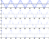
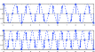

# <!--fit-->  Perfect Reconstruction with 2B 

---

<!-- _header:  -->

# UESTC 3018 — Communication Systems and Principles

Lecture 16 — Precursor to Digital Communications

Dr Hasan Abbas
<!-- transition: fade -->
<!--  -->

<!-- This is presenter note. You can write down notes through HTML comment. -->

---

# From Last Time ⌛

- Frequency Modulation Detection
<!-- Need to change the QR code here -->

---

# Today's Lecture 📆

- The (im)Pulse train
- Sampling Theorem
- Interpolation
- Pulse Train

---

# Sampling Theorem

- A signal $g(t)$ with bandwidth $<B$ can be reconstructed exactly from samples taken at any rate $R>2B$.
- Sampling can be achieved mathematically by multiplying by an impulse train. 

$$
III(t) = \sum_{k = -\infty}^{\infty} \delta (t - k)
$$

- Also called a comb function

$$
\overline{g}(t) = III(t)g(t) = \sum_{k = -\infty}^{\infty} g(t)\delta (t - kT) = \sum_{k = -\infty}^{\infty} g(kT_s)\delta (t - kT_s)
$$

---

# The Impulse Train

- Interesting the Fourier Transform of an impulse train is also an impulse train
- The complex exponentials cancel at non-integer frequencies and add up to an impulse at integer frequencies

$$
\mathcal{F} {III(t)} = \mathcal{F} \sum_{k = -\infty}^{\infty} g(t)\delta (t - k) = \int_{-\infty}^{\infty} e^{-j2\pi n f} =  III(f)
$$

---

# Fourier Transform of a Sampled Signal

The impulse train $III(t/Ts)$ is periodic with period $T_s$ and can be represented as the sum of complex exponentials of all multiples of the
fundamental frequency,

$$
III(t/Ts) = 1/Ts \sum_{k = -\infty}^{\infty} e^{-j2\pi f_s t} 
$$

- $f_s = 1/T_s$

---

# A Sampled Signal

---

# Sampled Signal and the Fourier Transform

---

# Sampled Cosines

---

# Sampled Examples

---

# The Minimum Sampling Rate
  
- When the sampling rate is too low, the spectral replicas overlap

---

# Aliasing 

- The spectral overlap

- The shaded frequencies overlap and are ambiguous.
- High positive frequencies wrap around to high negative frequencies
- What signal would you reconstruct if you assumed the signal was actually band limited?

---

# Aliasing Contd.

- Cosines at frequencies of 0.75 Hz and 1.25 Hz produce exactly the same samples at a sampling rate of 1 Hz

---

# Anti-aliasing Filter

- In practice, a sampler is always preceded by a filter to limit the signal bandwidth to match the sampling rate
- This may delete part of the signal if it isn’t bandlimited.
- It ensures that the signal that is sampled is bandlimited.

---

# Questions ❓
- You can ask on Menti
<!-- 
<!-- Need to change the QR code here -->

---

# Further Reading 

- Section 5.1 - Sampling Theorem
Modern Digital and Analog Communication Systems, $5^{th}$ Edition
- B P Lathi and Zhi Ding

---

# Get in touch

Hasan.Abbas@glasgow.ac.uk 