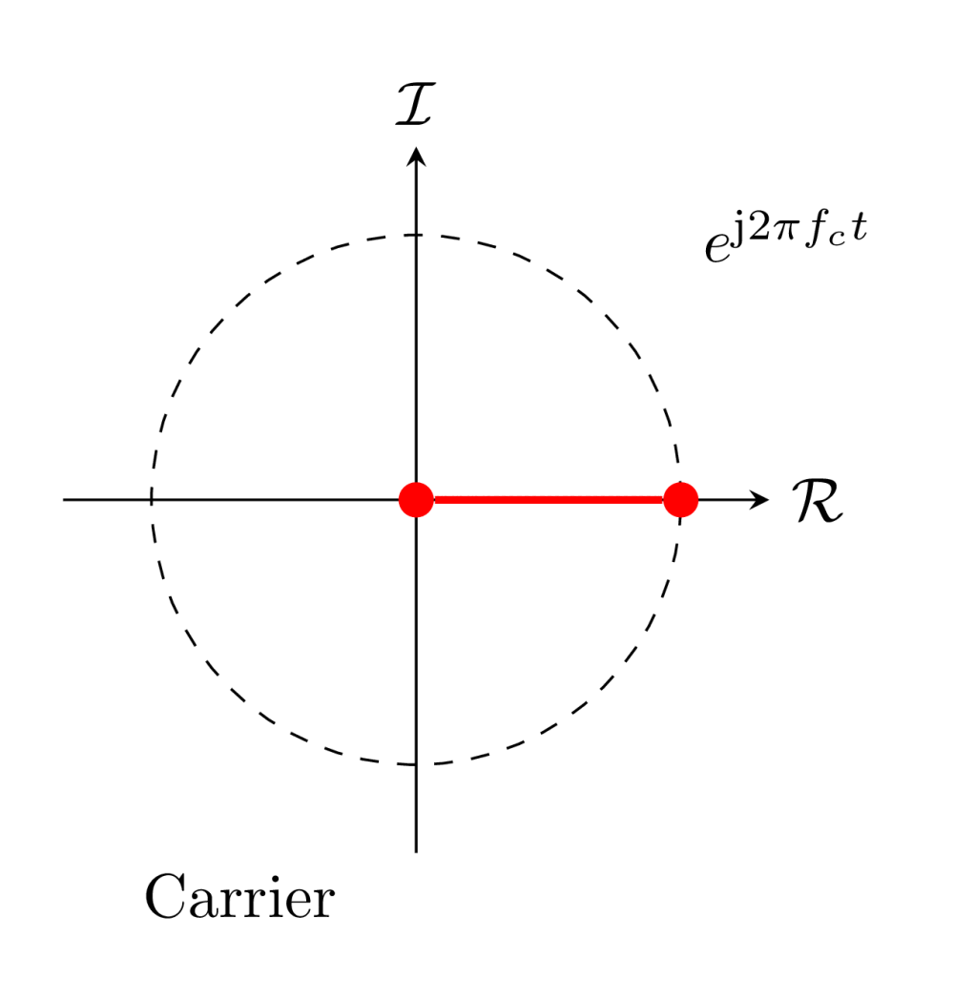
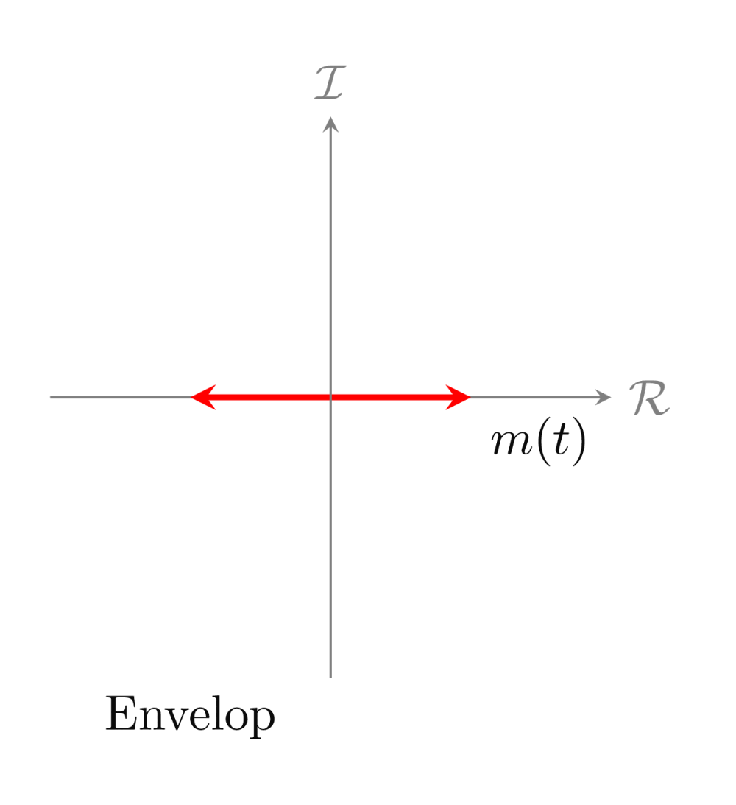
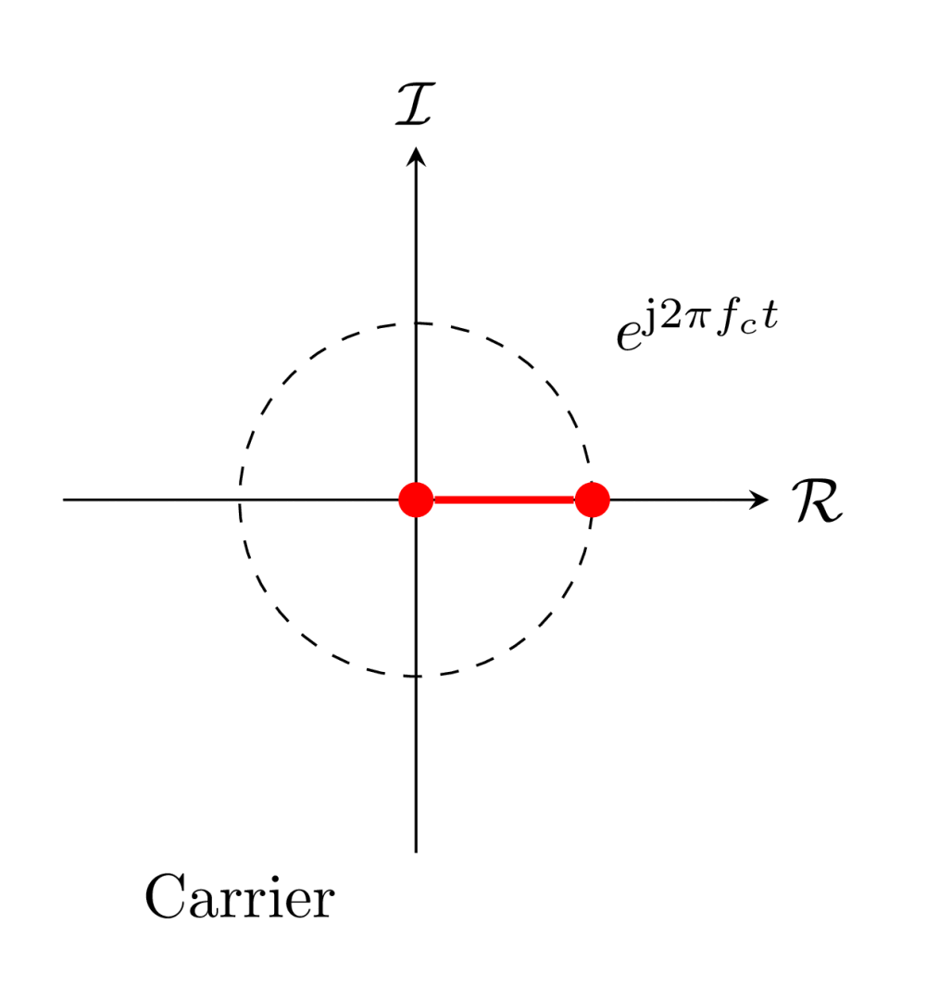
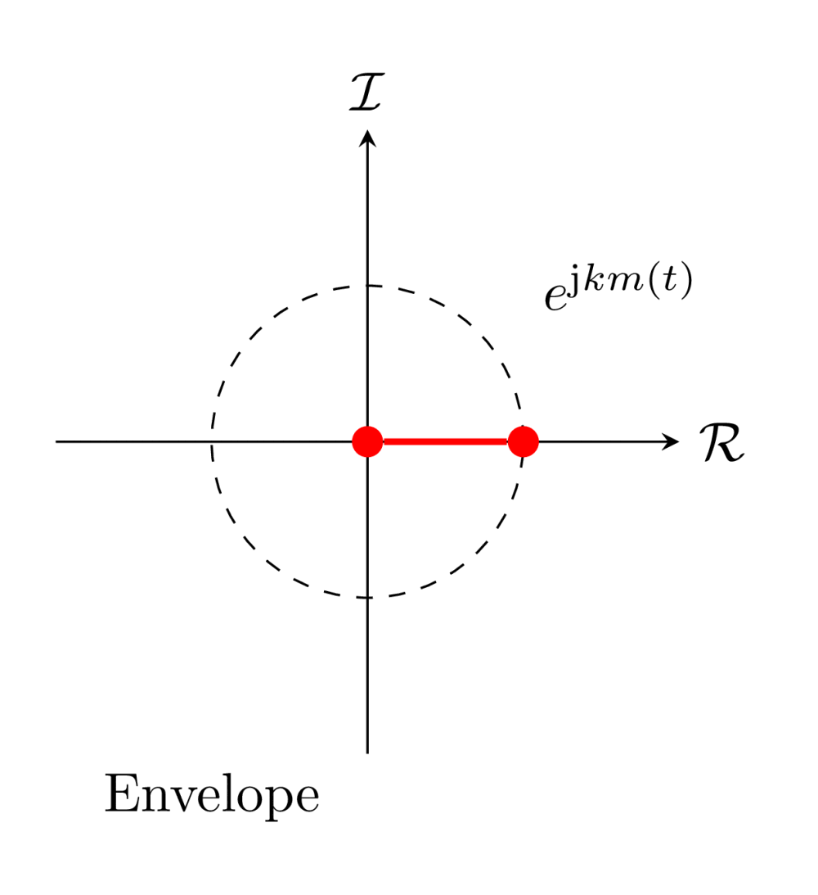
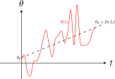
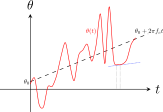
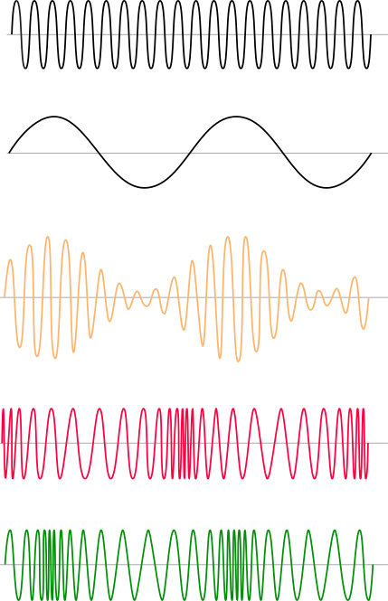
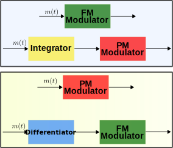

# <!--fit-->  💡 Modulation is the art of transforming simple signals into complex forms! 

---

<!-- _header:  -->

# UESTC 2018 - Communication Systems and Principles

Lecture 11 — Angle Modulation

Dr Hanaa Abumarshoud and Dr Hasan Abbas
<!-- transition: fade -->
<!--  -->

<!-- This is presenter note. You can write down notes through HTML comment. -->

---

# Reflection 🤔

- Why Modulation?
- Amplitude Modulation (AM) is a linear process
- AM wave is a band limited signal
- AM is not resilient to noise
  
<!-- Need to change the QR code here -->

---

# Today's Lecture 📆

- Angle Modulation
- Frequency Modulation (FM)
- Phase Modulation (PM)

---

# First, AM ... 🎗️

- For an AM signal, $m(t) \cos(2\pi f_c t)$
- The envelope changes along the real axis with $m(t)$
- Or $m(t)$ scales the carrier signal $\cos(2\pi f_c t)$

---

# Now ... 🎗️

- Include $m(t)$ as the **phase** of the carrier

$$
2 \cos \left(2 \pi f_c t+k m(t)\right)  = e^{j\left(2 \pi f_c t+k m(t)\right)}+e^{-j\left(2 \pi f_c t+k m(t)\right)}
$$

---
# <!--fit-->  Angle Modulation 

---

# Angle Modulation 🔑

- Keep the modulated wave amplitude the same
- We can modulate a carrier by changing the **phase** and **frequency**
- Former is PM and latter is FM
- Angle Modulation is much more complex than AM
- A non-linear process
- We focus on FM
$$
u(t) = A_c \cos (2 \pi f_c t + \phi (t)).
$$

---

# Instantaneous Frequency

- 🧭 Remember instantaneous velocity from high school days
- Use of derivatives to describe the **instantaneous** phenomenon
- We can vary the *instantaneous frequency* of the signal through $m(t)$

<!-- We need to find the slope of the signal which is the ins. frequency -->
---

# Instantaneous Frequency (contd.)

- At any time instant $t_0$, we can find the instantaneous frequency by taking the derivative

---

# A Generalised Sinusoid 

Lets look at,
$$
\varphi(t) = A \cos \theta (t)
$$

Here $\theta(t)$ is the generalised angle that can have any value
- For a true sinusoidal signal,  
$$
\theta(t) = \omega_c t + \theta_0
$$

---

# Finding the Instantaneous Frequency 

- The derivative of the generalised angle,
$$
\omega_i(t) = \frac{d\theta}{dt} = \theta'(t)
$$

- The other way, phase is the integral of the instantaneous frequency,
  
$$ 
\theta (t) = \int_{-\infty}^{t} \omega_i(u) du = \theta_0 + \int_{0}^{t} \omega_i(u) du
$$
- We can modulate by either varying $\omega_i(t)$ or $\theta(t)$
---

# Phase Modulation (PM)

- As the name suggests, we vary the , $\theta(t)$ **phase linearly** with $m(t)$

$$
\theta^{PM}(t) = \omega_c t + k_p m(t)
$$

- The generalised or in fact the transmitted signal is thus,

$$
\varphi^{\mathrm{PM}}(t) = A_c \cos (\omega_c t + k_p m(t))
$$

We get the instantaneous frequency as,
$$
\omega_i^{PM}(t) = \frac{d\theta}{dt} = \omega_c + k_p \dot{m}(t)
$$

- 🔑 $\omega_i^{PM}(t)$ is proportional to the rate of change of $m(t)$
- Rapid changes in $m(t)$ results in higher value of $\dot{m}(t)$
- What about the bandwidth of the signal?

---

# Frequency Modulation (FM)

- In FM we vary the $\theta(t)$ **frequency linearly** with $m(t)$,

$$
\omega_i^{FM}(t) = \omega_c +k_f m(t)
$$

The transmitted signal is thus,
$$
\varphi^{\mathrm{FM}}(t) = A_c \cos \left(\omega_c t + k_f m(t) \times t\right)
$$

Note the parameter $k_f$ which along with $m(t)$ determines the bandwidth
- The phase $\theta^{FM}$ is,
  
$$
\theta^{FM}(t) = \int_{-\infty}^{t} \omega_i^{FM}(u) du = \omega_c t + k_f \int_{-\infty}^{t} m(u) du
$$

- 🔑 $\theta^{FM}(t)$ to a phase modulator $\equiv$ $\omega_i^{PM}(t)$ to a frequency modulator.

<!-- The integral term needs to be broken into limits from -\infty to zero which can be safely considered to be zero for a causal signal. This leaves only 0 to t limits for the integral. -->
<!-- This also needs to be included with the fact the system is linear at least the part where the frequency varies linearly with the message signal -->
---
# <!--fit-->  📻 FM vs PM 

---

# Guess the 🟡, 🔴 and 🟢 signals

---

---

# Some Observations

- Regardless of PM or FM, angle modulation signal has constant amplitude
- Power of the signal remains the same irrespective of $k_p$ or $k_f$.
- PM is a $90\degree$ shifted version of FM and vice versa

--- 

# An Example

- Given a signal $m(t)$, sketch the FM and PM waves.
- $k_f = 2 \pi \times 10^{5}$, $k_p = 10\pi$ and $f_c = 100$ MHz.

---

# Questions 🤔

- You can ask on Menti

<!-- Need to change the QR code here -->

---
# Further Reading 

- Section 4.5 - Angle Modulation
Modern Digital and Analog Communication Systems, $5^{th}$ Edition
- B P Lathi and Zhi Ding

---

# Get in touch

Hanaa.Aburmarshoud@glasgow.ac.uk
Hasan.abbas@glasgow.ac.uk