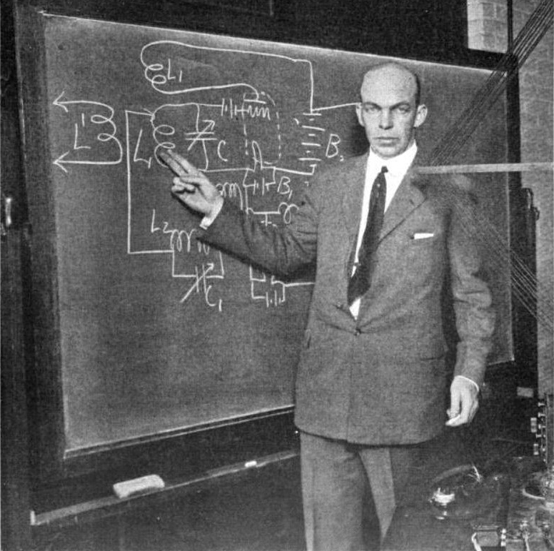
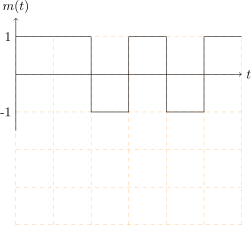
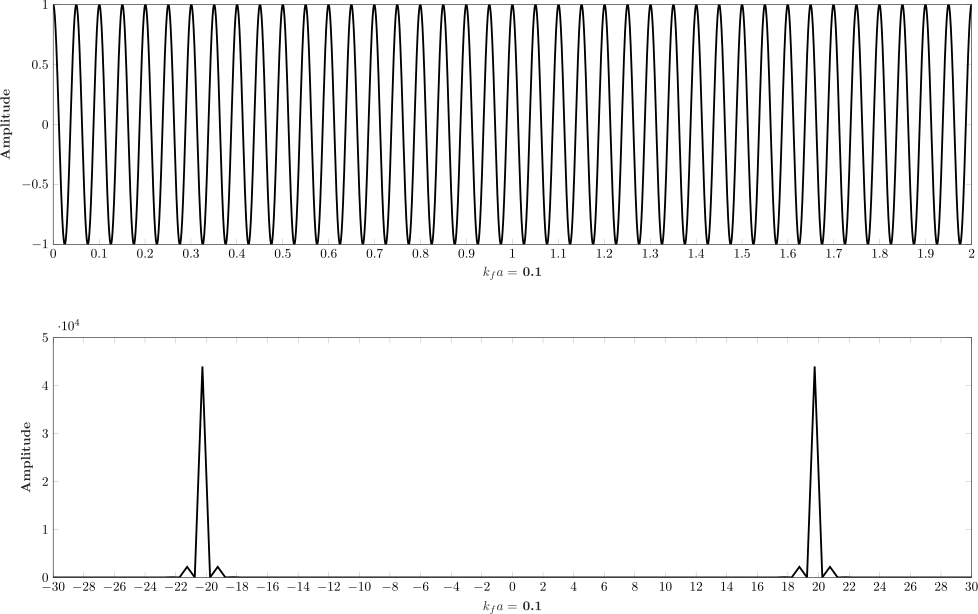
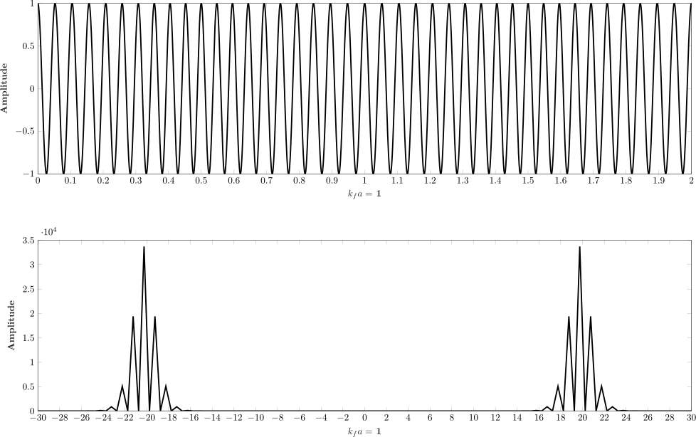
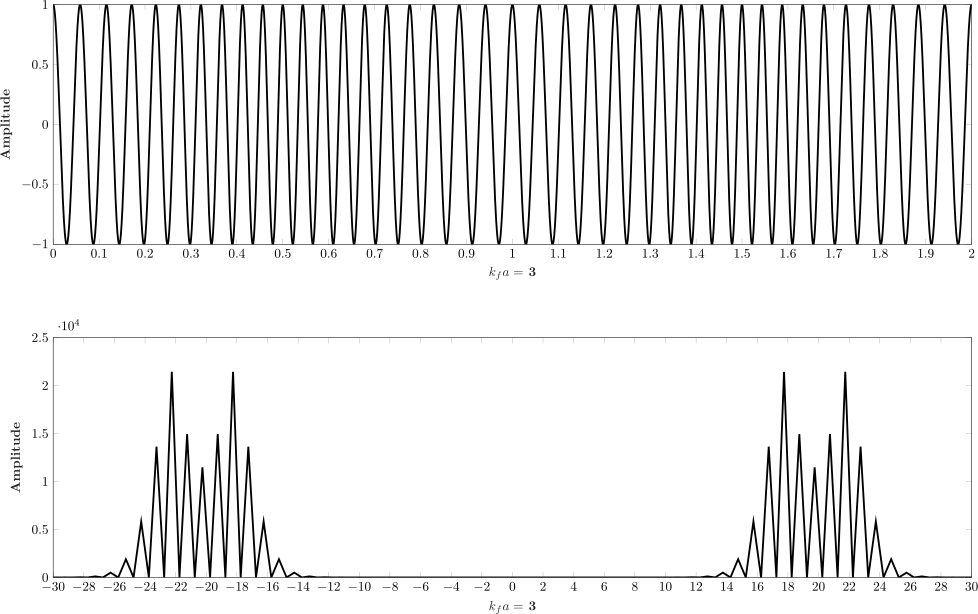
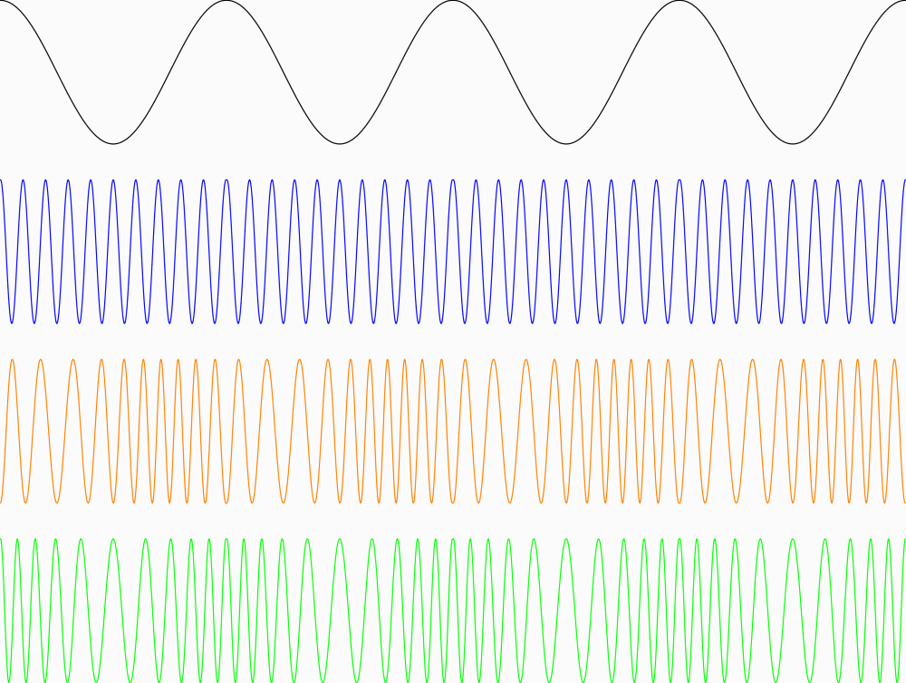
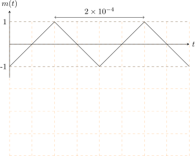

# <!--fit-->  FM: Where the sound is always sweeter! 📻 

---

<!-- _header:  -->

# UESTC 2018 - Communication Systems and Principles

Lecture 12 — Angle Modulation II

Dr Hanaa Abumarshoud and Dr Hasan Abbas
<!-- transition: fade -->
<!--  -->

<!-- This is presenter note. You can write down notes through HTML comment. -->

---

# From Last Time ⌛

- Angle Modulation is a non-linear process
- We don't change the amplitude
- PM and FM are very similar - a $90 \degree$ phase-shift
  
<!-- Need to change the QR code here -->

---

# Today's Lecture 📆

- Bandwidth in FM
- Carson's Rule
- Spectral Analysis

---

# Down the History Lane 📜

- Due to inherent non-linearity, FM is hard to analyse
- Can't really apply Fourier transform tools
- Motivation was to reduce the bandwidth
- Turns out FM has infinite theoretical bandwidth

---

# First an Example - FSK/PSK

- Given a signal $m(t)$, sketch the FM and PM waves.
- $k_f = 2 \pi \times 10^{5}$, $k_p = \pi/2$ and $f_c = 100$ MHz.

---

# <!--fit-->  Bandwidth Analysis ♾️ 

---

# Analysing Bandwidth

- To simplify the expression, $a(t)=\int_{-\infty}^{t}m(u)\,d u$
- Let's define, 
$$
\hat{\varphi}^{\mathrm{FM}}(t)=A\,e^{j[\omega_{c}t+k_{f}a(t)]}=A e^{j k_{f}a(t)}e^{j\omega_{c}t}
$$
from where, 
$$\varphi^{\mathrm{FM}} (t) = \Re \left[\hat{\varphi}^{\mathrm{FM}}(t) \right] .
$$
- Expanding the complex exponential through the Maclaurin power series,
$$
\hat{\varphi}^{\mathrm{FM}}(t) = A \left[ 1 + jk_f a(t) - \frac{k_f^2}{2!}a^2(t) + \dots + j^n \frac{k_f^n}{n!}a^n(t)\right] \times e^{j \omega_c t}
$$

---

# Some Observations

- If $m(t)$ or $M(\omega)$ has a bandwidth of B
- Then $ a(t)$ also has a bandwidth of $B$ Hz (integration is a linear operator).
- The $n^{th}$ term, $\frac{k_f^n}{n!}a^n(t)$ will have a bandwidth of $n \times B$
- This is due to convolution principle, i.e.
- $A(\omega) * A(\omega)$ spreads the Fourier transform to $2B$ 
- Essentially, we have **infinite bandwidth**
- But...
- $\frac{k_f^n}{n!}a^n(t) \to 0$, meaning we only care about the first few terms.

---

# FM Signal Representation

- Using the $\varphi^{\mathrm{FM}} (t) = \Re \left[\hat{\varphi}^{\mathrm{FM}}(t) \right]$ representaion, we get,

$$
\begin{aligned}
\varphi^{\mathrm{FM}} (t) &= \Re  \left\{A \left[ 1 + jk_f a(t) - \frac{k_f^2}{2!}a^2(t) + \dots + j^n \frac{k_f^n}{n!}a^n(t)\right] \times \left[\cos (2 \pi f_c t) + j \sin (2 \pi f_c t) \right] \right\} \\
&= A \left( \cos (2 \pi f_c t)  - k_f a(t) \sin (2 \pi f_c t) - \frac{k_f^2}{2!}a^2(t) \cos (2 \pi f_c t) + \dots \right) \\
&\approx A \left( \cos (2 \pi f_c t)  - k_f a(t) \sin (2 \pi f_c t) \right)
\end{aligned}
$$

- This is a narrowband FM signal representation
- The approximation is good when $\left| k_f a(t) \right| \ll 1$
- Generally, we consider 2B bandwidth as narrowband
- PM has a similar expression

---

# Playing with the tones

---

# Playing with the tones

---

# Playing with the tones

---

# A Dilemma 😵‍💫

- To make the best of FM (or PM), we need make the frequency deviation large enough
- Need to choose a large enough $k_f$ to break the $\left| k_f a(t) \right| \ll 1$ condition
- This is the **wideband** FM case
- ⚠️ We can't ignore the higher order terms in the power series anymore
- We need to rely on empirical formulas to estimate the bandwidth

---

# Some Observations

- Regardless of PM or FM, angle modulation signal has constant amplitude
- Power of the signal remains the same irrespective of $k_p$ or $k_f$.
- PM is a $90\degree$ shifted version of FM and vice versa

--- 

# An Example

- Given a signal $m(t)$, sketch the FM and PM waves.
- $k_f = 2 \pi \times 10^{5}$, $k_p = 10\pi$ and $f_c = 100$ MHz.

---

# Questions 🤔

- You can ask on Menti

<!-- Need to change the QR code here -->

---

# Further Reading 

- Section 4.6 - Bandwidth Analysis of Angle Modulations 
Modern Digital and Analog Communication Systems, $5^{th}$ Edition
- B P Lathi and Zhi Ding

# Get in touch

Hanaa.Aburmarshoud@glasgow.ac.uk
Hasan.abbas@glasgow.ac.uk