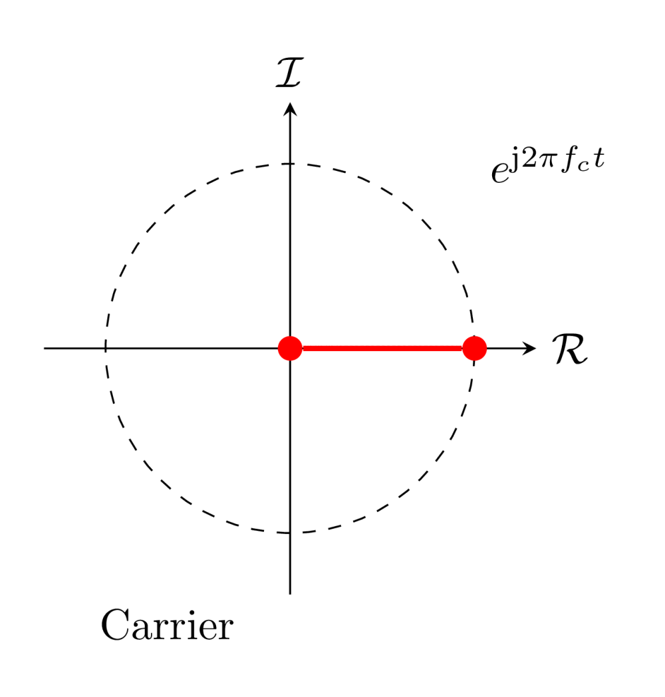
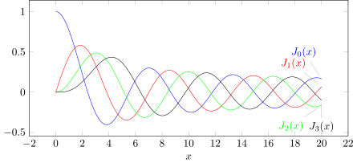
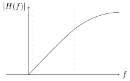

# <!--fit-->  In FM, be quick, precise, and know your angles! 📻 

---

<!-- _header:  -->

# UESTC 2018 - Communication Systems and Principles

Lecture 13 — Angle Modulation Detection

Dr Hanaa Abumarshoud and Dr Hasan Abbas
<!-- transition: fade -->
<!--  -->

<!-- This is presenter note. You can write down notes through HTML comment. -->

---

# From Last Time ⌛

- Angle Modulation Bandwidth Dilemma
  
<!-- Need to change the QR code here -->

---

# Today's Lecture 📆

- FM with a Tone
- FM Demodulation Techniques

---

# FM with a Tone

- Due to inherent non-linearity, FM is hard to analyse
- Lets start off with a tone i.e. a sinusoidal signal, $m(t) = \cos (2 \pi f_m t)$

$$
a(t) = \int_{-\infty}^{t} m(u) du = \frac{1}{2 \pi f_m} \sin (2 \pi f_m t)
$$
- From last time, $a(t)=\int_{-\infty}^{t}m(u)\,d u$
$$
\hat{\varphi}^{\mathrm{FM}}(t)=A\,e^{j[\omega_{c}t+k_{f}a(t)]}=A e^{j k_{f}a(t)}e^{j\omega_{c}t}
$$
from where,
$$
\hat{\varphi}^{\mathrm{FM}}(t) = A \,e^{j[\omega_{c}t+\frac{k_f}{2 \pi f_m} \sin (2 \pi f_m t)]}= A e^{j \left(\omega_{c}t + \beta\sin (2\pi f_m t)\right)}
$$
- Here we assume $a(-\infty) = 0$ (causality)

---

# FM with a Tone (contd.) - The Bessel Function

- $e^{j \beta \sin(2\pi f_m t)}$ is a periodic function with frequency $f_m$
- We can have a Fourier series representation,
  $$
  e^{j \beta \sin(2\pi f_m t)} = \sum_n c_n (\beta) e^{2 n \pi j f_m t}
  $$
- The complex Fourier coefficient  
$$
c_n = f_m \int_{-1/{2f_m}}^{1/{2f_m}} e^{j \beta \sin(2\pi f_m t)} e^{-2 n \pi j f_m t} dt
$$

---

# FM with a Tone (contd.) - The Bessel Function

- Defining a new substitute variable, $x =2 \pi f_m t$
$$
c_n = \frac{1}{2 \pi} \int_{-\pi}^{\pi} e^{j \beta \sin x  - n j x} dx = J_n(\beta)
$$

- This is the Bessel function of 1st kind and order $n$
- $\beta$ is the deviation ratio

---

# <!--fit-->  Demodulation 

---

# FM Demodulation

- Recall, the instantaneous frequency changes with signal amplitude, 
- $\omega_i^{FM}(t) = \omega_c +k_f m(t)$
- We need a system where output is proportional to the input.
- The simplest is an ideal differentiator ($j \omega$)
- Need to convert frequency variations into amplitude variations
- Then use envelope detection

---

# FM Demodulation (contd.)

$$
\begin{aligned}
\dot{\varphi}^{\mathrm{FM}}(t) & =\frac{d}{d t}\left\{A \cos \left[\omega_c t+k_f \int_{-\infty}^t m(\alpha) d \alpha\right]\right\} \\
& =A\left[\omega_c+k_f m(t)\right] \sin \left[\omega_c t+k_f \int_{-\infty}^t m(\alpha) d(\alpha)-\pi\right]
\end{aligned}
$$
- Note the signal $m(t)$ is present both in the envelope and frequency
- Because $\omega = k_f m_p < \omega_c$, we have $\omega_c + k_f m(t) > 0$
- We can simply perform envelope detection (as in AM).

---

# FM Demodulation

---

# A Simple RC Circuit

- A Simple RC highpass circuit can be used to detect the slope
- The transfer function (voltage across the resistor) is
$$
H(\omega) = \frac{R}{R + \frac{1}{j\omega C}} = \frac{j\omega RC}{1 + j\omega RC} \approx j \omega RC
$$
- The approximation is true when $\omega_c RC \ll 1$
- We have a differentiator
- This is one of many possibilities

---

# Superheterodyne Receivers

- Frequency Conversion or mixing is done to change the carrier frequency from $\omega_c$ to $\omega_{IF}$
- We call IF as intermediate frequency
$$
\begin{aligned}
x(t) &= 2 m(t) \cos \omega_c t \cos \omega_{mix} t \\
  &= m(t) \left[ \cos (\omega_c + \omega_{mix}) t + \cos (\omega_c - \omega_{mix}) t \right]
\end{aligned}
$$
- Setting $\omega_{mix} = \omega_c \pm \omega_{IF}$
$$
\begin{aligned}
x(t) &=  m(t) \left[ \cos \omega_{IF} t + \cos (2\omega_c \mp \omega_{IF}) t \right]
\end{aligned}
$$

<!-- Key Components and Their Functions:
RF Amplifier:

Amplifies the incoming RF signal to increase its strength before mixing.
Typically uses wideband amplification to accommodate a range of frequencies.
Must have low noise figure to minimize noise introduced by the receiver.
Local Oscillator:

Generates a sinusoidal signal at a frequency offset from the RF signal.
The frequency offset is chosen to produce the desired IF frequency.
Often uses a voltage-controlled oscillator (VCO) for tunability.
Mixer:

Multiplies the RF signal and the local oscillator signal.
Produces sum and difference frequencies.
Nonlinear device, typically a diode or transistor.
IF Amplifier:

Amplifies the IF signal.
Narrowband amplification is used to select the desired IF frequency and reject unwanted signals.
Provides most of the gain in the receiver.
IF Filter:

Filters the IF signal to remove noise and interference.
Typically a bandpass filter centered at the IF frequency.
Demodulator:

Extracts the original information-carrying signal from the IF signal.
The type of demodulator depends on the modulation scheme used (e.g., AM, FM, QAM). -->

---

# Superheterodyne Receivers

- Downconverting to IF allows us to use sensitive amplifiers
- Bandpass filter is  very hard to design at RF
- Commonly used in many broadcast systems

---

# Phased-Locked Loop

- A negative feedback system used in FM demodulation
- Compares the phase of the FM signal with the phase of a locally generated reference signal.
- First generate a VCO output $r(t)$  Phase Comparison 
- Check for errors with $e(t)$  Error Generated 
- $e(t)$ controls the VCO frequency  VCO function 
- VCO adjuts the frequency $x(t)$  Phase Lock 

- Objective is to minimise the phase difference between $x(t)$ and $y(t)$.

<!-- --- -->
<!-- 
<!-- # fit  FM Generation 📡  -->
<!--  -->

<!-- --- -->

<!-- # Generation of FM Signals

- The instantaneous frequency of the carrier changes with $m(t)$
- A  voltage-controlled oscillator  does exactly this!
-  -->

---

# Questions ❓
- You can ask on Menti

<!-- Need to change the QR code here -->

---

# Further Reading 

- Section 4.7 - Demodulation of FM Signals 
Modern Digital and Analog Communication Systems, $5^{th}$ Edition
- B P Lathi and Zhi Ding

---

# Get in touch

Hanaa.Aburmarshoud@glasgow.ac.uk
Hasan.Abbas@glasgow.ac.uk 