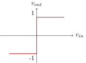

<!-- _header:  -->

# UESTC 3018 — Communication Systems and Principles

Lecture 15 — Tutorial Time ⌛

Dr Hasan Abbas and Jionghui Wang
<!-- transition: fade -->
<!--  -->

<!-- This is presenter note. You can write down notes through HTML comment. -->

---

# Superheterodyne Receivers

- Frequency Conversion or mixing is done to change the carrier frequency from $\omega_c$ to $\omega_{IF}$
- We call IF as intermediate frequency
$$
\begin{aligned}
x(t) &= 2 m(t) \cos \omega_c t \cos \omega_{mix} t \\
  &= m(t) \left[ \cos (\omega_c + \omega_{mix}) t + \cos (\omega_c - \omega_{mix}) t \right]
\end{aligned}
$$
- Setting $\omega_{mix} = \omega_c \pm \omega_{IF}$
$$
\begin{aligned}
x(t) &=  m(t) \left[ \cos \omega_{IF} t + \cos (2\omega_c \mp \omega_{IF}) t \right]
\end{aligned}
$$

<!-- Key Components and Their Functions:
RF Amplifier:

Amplifies the incoming RF signal to increase its strength before mixing.
Typically uses wideband amplification to accommodate a range of frequencies.
Must have low noise figure to minimize noise introduced by the receiver.

Local Oscillator:
Generates a sinusoidal signal at a frequency offset from the RF signal.
The frequency offset is chosen to produce the desired IF frequency.
Often uses a voltage-controlled oscillator (VCO) for tunability.

Mixer:
Multiplies the RF signal and the local oscillator signal.
Produces sum and difference frequencies.
Nonlinear device, typically a diode or transistor.

IF Amplifier:
Amplifies the IF signal.
Narrowband amplification is used to select the desired IF frequency and reject unwanted signals.
Provides most of the gain in the receiver.
IF Filter:

Filters the IF signal to remove noise and interference.
Typically a bandpass filter centred at the IF frequency.
Demodulator:

Extracts the original information-carrying signal from the IF signal.
The type of demodulator depends on the modulation scheme used (e.g., AM, FM, QAM). -->

---

# Superheterodyne Receivers

- Down converting to IF allows us to use sensitive amplifiers
- Bandpass filter is  very hard to design at RF
- Commonly used in many broadcast systems

---

# Phased-Locked Loop

- A negative feedback system used in FM demodulation
- Compares the phase of the FM signal with the phase of a locally generated reference signal.
- First generate a VCO output $r(t)$  Phase Comparison 
- Check for errors with $e(t)$  Error Generated 
- $e(t)$ controls the VCO frequency  VCO function 
- VCO adjusts the frequency $x(t)$  Phase Lock 

- Objective is to minimise the phase difference between $x(t)$ and $y(t)$.

<!-- --- -->
<!-- 
<!-- # fit  FM Generation 📡  -->
<!--  -->

<!-- --- -->

<!-- # Generation of FM Signals

- The instantaneous frequency of the carrier changes with $m(t)$
- A  voltage-controlled oscillator  does exactly this!
-  -->
-  
---

# <!--fit-->  FM Generation 📡 

---

# Generation of FM Signals

- The instantaneous frequency of the carrier changes with $m(t)$
- A voltage-controlled oscillator does exactly this!
- In FM, recall
$$
\omega_i (t) = \omega_c + k_f m(t)
$$
- There is another simpler method, called the indirect FM generation

---

# Narrowband FM Generation

- Recall, for narrowband FM, $|k_f a(t)| \ll 1$
$$
\psi^{\mathrm{NBFM}}(t) \simeq A \left[ \cos \omega_c t - k_f a(t) \sin \omega_c t \right]
$$
- This is a linear (simpler) system
- We can use an AM modulator (DSB-SC) with a phase shifter ($\sin \omega_c t$) 

---

# Narrowband FM Generation

- The above is simple, yet there are some artefacts
- Some amplitude modulation remains in the system

---

# The Limiter and Bandpass Filter

- Amplitude variations create noise and interference 👎
- We first use a limiter circuit to limit any amplitude fluctuations
$$
v_o(t)= \begin{cases}+1 & v_i(t)>0 \\ -1 & v_i(t)<0\end{cases}
$$

---

# The Limiter and Bandpass Filter (contd.)

- The input to the limiter and bandpass filter blocks is,
$$
v_{i}(t)=A(t)\cos\theta(t) \, \mathrm{,}\, \theta(t)=2\pi f_{c}t+k_{f}a(t)
$$
- $A(t)$ is ideally constant but usually very slowly varying
$$
v_o(\theta)= \begin{cases}+1 & \cos \theta >0 \\ -1 & \cos \theta<0\end{cases}
$$
$$
\begin{aligned}
    v_{o}(\theta) &= \frac{4}{\pi}\left(\cos\theta-\frac{1}{3}\cos 3\theta+\frac{1}{5}\cos 5\theta+\cdots\right) \\
    {}&= \frac{4}{\pi}\Big(\cos\left(2\pi f_{c}t+k_{f}a(t)\right)-\frac{1}{3}\cos 3\left(2\pi f_{c}t+k_{f}a(t)\right)+\cdots\Big)
\end{aligned}
$$

---

# <!--fit-->  Tutorial Time 🕗 

---

# Our GTA - Jionghui Wang

- B.Eng. UESTC 2020
- PhD Candidate at UESTC since September, 2022
- Works in millimetre wave/THz communication, signal processing
- Active in Integrated sensing and communications (ISAC).

---

# Questions ❓
- You can ask on Menti
<!-- 
<!-- Need to change the QR code here -->

---

# Further Reading 

- Chapter 4
Modern Digital and Analog Communication Systems, $5^{th}$ Edition
- B P Lathi and Zhi Ding

---

# Get in touch

Hasan.Abbas@glasgow.ac.uk 