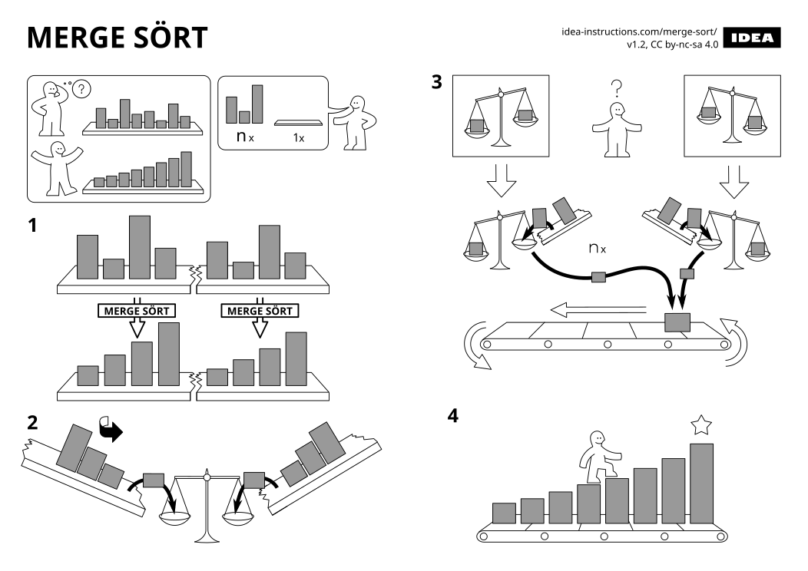
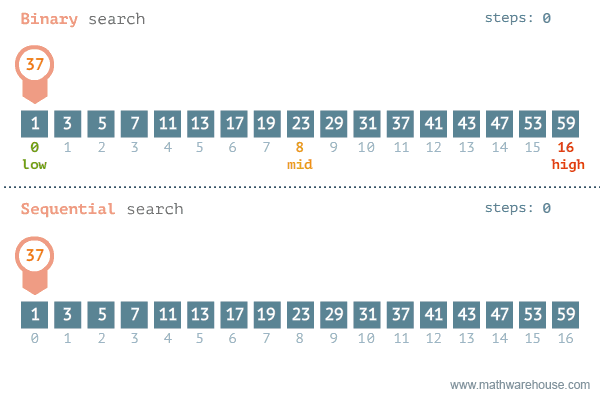
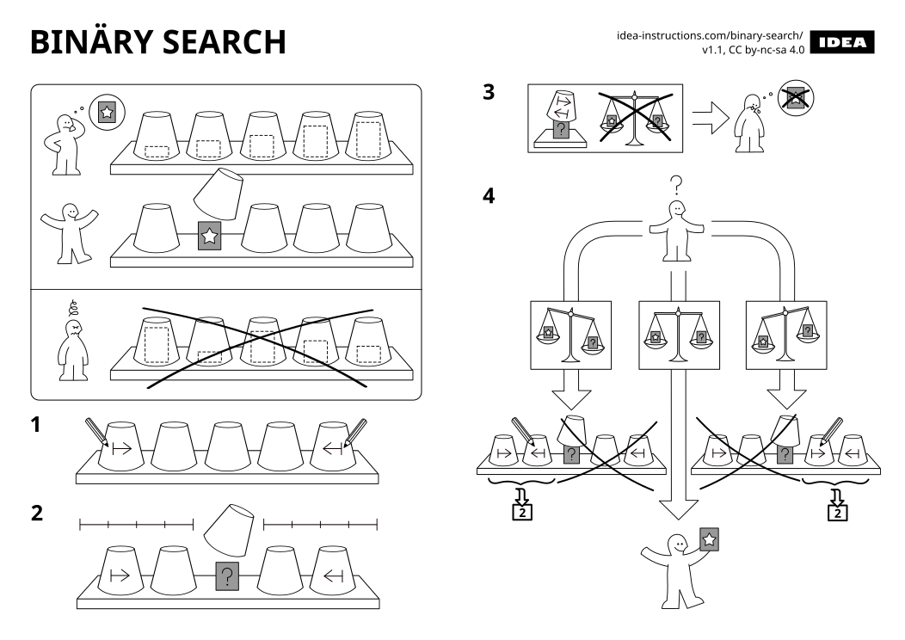

<div style="width: 64%; float:left">

#
#
#
# 🧽 ABSORB what is useful,
# 🗑️ DISCARD what is not,
# ➕ ADD what is uniquely your own
## &mdash; 李小龍

</div>

<div style="width: 30%; float:right">


</div>


---

<!-- _header:  -->

# UESTC 1005 — Introductory Programming

<h2>Lecture 12 &mdash; Double Pointers, Bubble Sort, Binary Search</h2>

Dr. Mark D. Butala

<!-- transition: fade -->
<!-- <style scoped>a { color: #eee; }</style> -->

<!-- This is presenter note. You can write down notes through HTML comment. -->

<style scoped>
    .team-table {
        .bottom: 1%;
    }
</style>

<!-- <div align="center"> -->
<!-- <p style="margin-bottom:0.5cm;"> -->

<!-- | Chengdu Team | Hainan Team | -->
<!-- |--------------|-------------| -->
<!-- | Dr. Syed M. Raza | Dr. Mark D. Butala | -->
<!-- | Dr. Ahmad Zoha | Prof. Bo Liu | -->
<!-- | Dr. Hassan T. Abbas | Prof. Chong Li | -->

<!-- </p> -->
<!-- </div> -->

---

# Questions 🙋❓

- Ask me anything (programming-related 😎)

---

# Lecture Outline

- Double pointers ✨✨
<!-- - Doubly linked list   ...↔️📦↔️📦↔️📦↔️📦↔️📦↔️... -->
- Bubble sort 🫧
- Binary search  🔟🔎
- Exam recommendations 💡

---

# Recap of pointers

- In the scope of IP, we have used pointers ╰┈➤ in the following ways:
  + To pass a variable to a function by reference
  + Equivalence (in most cases): array variable name and pointer to first element
  + For dynamic memory allocation
  + To store the link to the next node in a linked list
- Of these, passing a variable by reference is the most common case

---

# What is a pointer to a pointer?!? 🤯

- Understand this, and you understand pointers (and call by reference) 👩🏻‍🎓👨🏻‍🎓
- Recall: a variable passed by reference can be modified by the function
- Passing a pointer variable by reference "gives permission" to the function to modify the pointer
- A reference to a pointer (`&x_ptr` where `x_ptr` is a pointer) is a pointer to a pointer
- What's the point 😜? 👉 double pointers occur when you pass a pointer variable by reference to a function

---

# Double pointer example: `longer_string` function

``` c
// c_ptr_ptr is a pointer, to a pointer, to a char
unsigned longer_string(char **c_ptr_ptr, char s1[], char *s2) {
    // Compare the lengths of strings s1 and s2. Assign the pointer
    // passed by reference (c_ptr_pttr) to the longer string and
    // return the length of the longer string.
    unsigned N1 = strlen(s1);
    unsigned N2 = strlen(s2);
    if (N2 > N1) {
        *c_ptr_ptr = s2;
        return N2;
    }
    else {
        *c_ptr_ptr = s1;
        return N1;
    }
}
```

---

# Double pointer example: `main`

``` c
#include <stdio.h>
#include <string.h>

// c_ptr_ptr is a pointer, to a pointer, to a char
unsigned longer_string(char **c_ptr_ptr, char s1[], char *s2) {
    // See implementation on previous slide
}

int main(void) {
    char *string1  = "Hello World";
    char string2[] = "IP rulz!";
    char *c_ptr = NULL;

    unsigned N = longer_string(&c_ptr, string1, string2);
    printf("The longer string is \"%s\" which has a length of %u\n", c_ptr, N);
    // Output: The longer string is "Hello World" which has a length of 11

    return 0;
}
```

---

# Pointer to a pointer to a pointer to a ...

<style scoped>div.link{font-size:20px;}</style>

<div align="center" class="link">

(adapted from https://stackoverflow.com/questions/5580761/why-use-double-indirection-or-why-use-pointers-to-pointers)

</div>

- If you want to have an array of characters (a **word**), you can use `char *word`
- If you want an array of words (a **sentence**), you can use `char **sentence`
- If you want an array of sentences (a **paragraph**), you can use `char ***paragraph`
- If you want an array of paragraphs (a **book**), you can use `char ****book`
- If you want an array of books (a **library**), you can use `char *****library`

### An array, of arrays, of arrays, ... is likely not the best data structure for this case

- This example illustrates the *semantics* of a pointer: it indicates an array of a given type

---

# <!--fit--> <span style="color:white">Bubble Sort: A simple sorting algorithm</span>


---

# Bubble sort (冒泡排序) 🫧

<div align="center">


(https://en.wikipedia.org/wiki/Bubble_sort)

</div>

- In bubble sort, small values "bubble" to the top and large values "sink" to the bottom
- The algorithm: set `i=0` and `N_i = N - 1` where `N` is the length of the list
  + If `value[i]` is greater than `value[i+1]` then swap the values
  + Increment `i++` and stop when `i > N_i - 1`
- The largest value encounterd will now appear at index `N_i`
- Set `i=0`, decrement `N_i--`, and repeat until no swap occurs

---

# Bubble sort implementation 👨‍💻

``` c
void sortLL(struct IntNode *head, unsigned int length) {
    assert(head != NULL);
    int swap_occurred;
    unsigned int N_i = length;
    do {
        swap_occurred = 0;
        struct IntNode *node = head;
        for (unsigned int i = 0; i < N_i - 1; i++, node = node->next) {
            if (node->value > node->next->value) {
                swapInt(&node->value, &node->next->value);
                swap_occurred = 1;
            }
        }
        N_i--;
    } while (swap_occurred);
}
```

---

# Bubble sort performance

- Bubble sort is said to have $O(N^2)$ complexity
    + For each element in the list, do operations on the remaining elements
    + Double the list length and bubble sort takes $4\times$ as long ⏱😬
- More complex sorting algorithms, e.g., quicksort, have $O(N \log N)$ performance
- Donald Knuth, *The Art of Computer Programming*, "the bubble sort seems to have nothing to recommend it, except a catchy name and the fact that it leads to some interesting theoretical problems" 🔥🤣


---

# (Supplemental 补充材料) A "real" sort algorithm

<div style="transform: translateX(150px); margin: 0 auto;">



</div>


<!-- # <\!--fit-\-> <span style="color:white">Doubly Linked List</span> -->

<!--  -->

<!-- --- -->

<!-- # Doubly linked lists: the what 🤔 and why 🤩 -->

<!-- - So far we have introduced *singly* linked lists -->
<!--   + Each node stores the pointer to the next node  (... ➡️ 📦 ➡️ 📦 ➡️ ...) -->
<!--   + Supports traversal from list beginning (`HEAD`) to end (`TAIL`) -->

<!-- - Let us add a link to the previous node  (... ↔️ 📦 ↔️ 📦 ↔️ ...) -->
<!-- ``` c -->
<!-- struct PersonNode { -->
<!--     char name[41]; -->
<!--     unsigned age; -->
<!--     struct PersonNode *next; -->
<!--     struct PersonNode *prev; -->
<!-- } -->
<!-- ``` -->

<!-- - Enables forward and backwards traversal (and added memory overhead) -->

<!-- --- -->

<!-- # Reverse traversal example -->

<!-- ``` c -->
<!-- #include <stdlib.h> -->
<!-- #include <stdio.h> -->

<!-- int main() { -->
<!--     struct PersonNode { -->
<!--         char name[41]; -->
<!--         unsigned age; -->
<!--         struct PersonNode *next; -->
<!--         struct PersonNode *prev; -->
<!--     }; -->

<!--     struct PersonNode taichonaut1 = {"Yang Liwei", 59, NULL, NULL}; -->
<!--     struct PersonNode taichonaut2 = {"Fei Junlong", 59, NULL, NULL}; -->
<!--     struct PersonNode taichonaut3 = {"Liu Yang", 46, NULL, NULL}; -->

<!--     struct PersonNode *HEAD = &taichonaut1; -->
<!--     taichonaut1.next = &taichonaut2; taichonaut2.next = &taichonaut3; -->
<!--     taichonaut3.prev = &taichonaut2; taichonaut2.prev = &taichonaut1; -->
<!--     struct PersonNode *TAIL = &taichonaut3; -->

<!--     for (struct PersonNode *node = TAIL; node != NULL; node = node->prev) { -->
<!--         printf("%s (%d)  ", node->name, node->age); -->
<!--     } -->
<!--     // Output: Liu Yang (46)  Fei Junlong (59)  Yang Liwei (59) -->

<!--     return 0; -->
<!-- } -->
<!-- ``` -->

<!-- --- -->

<!-- # Doubly linked list insertion -->

<!-- - Recall `insertNode` for a singly linked list was fairly complex 😵‍💫 -->
<!-- - Added complexity for a doubly linked list: `next` and `prev` member updates -->
<!-- - Let us consider doubly linked list `insertNodeRight` (insert to right of given node) -->
<!-- - For added challenge 🏋️, consider nodes with dynamically allocated data: -->

<!-- ``` c -->
<!-- struct StringNode { -->
<!--     char *data; -->
<!--     struct StringNode *next; -->
<!--     struct StringNode *prev; -->
<!-- }; -->


<!-- struct StringNode *insertNodeRight(struct StringNode *node_ptr, const char *str) { -->
<!--     // We will consider the code implementation after a few more slides -->
<!-- } -->
<!-- ``` -->

<!-- --- -->

<!-- # Case 1: `insertNodeRight` to empty list -->

<!-- `HEAD = TAIL = insertNodeRight(NULL, "Hello");` -->

<!-- <div class="columns"> -->

<!-- <div> -->

<!-- ## Before call -->

<!--  -->

<!-- </div> -->

<!-- <div> -->

<!-- ## After call -->

<!--  -->

<!-- </div> -->

<!-- </div> -->

<!-- --- -->

<!-- # Case 2: `insertNodeRight` to `TAIL` of list -->

<!-- `TAIL = insertNodeRight(TAIL, "World");` -->

<!-- <div class="columns"> -->

<!-- <div> -->

<!-- ## Before call -->

<!--  -->

<!-- </div> -->

<!-- <div> -->

<!-- ## After call -->

<!--  -->

<!-- </div> -->

<!-- </div> -->


<!-- --- -->

<!-- # Case 3: `insertNodeRight` general case -->

<!-- `struct StringNode *new_node = insertNodeRight(node_ptr, "to_the");` -->

<!-- <div class="columns"> -->

<!-- <div> -->

<!-- ## Before call -->

<!--  -->

<!-- </div> -->

<!-- <div> -->

<!-- ## After call -->

<!--  -->

<!-- </div> -->

<!-- </div> -->


<!-- --- -->

<!-- # Doubly linked list insertion implementation 🛠️ -->

<!-- ``` c -->
<!-- struct StringNode *insertNodeRight(struct StringNode *node_ptr, const char *str) { -->
<!--     struct StringNode *new_node = malloc(sizeof(struct StringNode));  // allocate memory to store new node -->
<!--     assert(new_node); -->
<!--     new_node->data = malloc(sizeof(char) * (strlen(str) + 1));        // allocate memory to store string data -->
<!--     assert(new_node->data); -->
<!--     strcpy(new_node->data, str); -->
<!--     if (node_ptr != NULL) { -->
<!--         // link newly created node to current node's linked node -->
<!--         new_node->next = node_ptr->next; -->
<!--         new_node->prev = node_ptr; -->
<!--         // link current node to newly created node -->
<!--         node_ptr->next = new_node; -->
<!--         // link next node back to newly created node -->
<!--         if (new_node->next != NULL) { -->
<!--             new_node->next->prev = new_node; -->
<!--         } -->
<!--     } -->
<!--     return new_node; -->
<!-- } -->
<!-- ``` -->

<!-- - There is a LOT happening in the above code -->
<!-- - We would NEVER expect you to write code of this complexity 🧬 in an exam ✍📝 -->

<!-- --- -->

<!-- # Tidying up `StringNode`-based linked list -->

<!-- - There are two `malloc`s in `insertNodeRight` to allocate memory for: -->
<!--   + The `data` member -->
<!--   + The newly created `StringNode` -->

<!-- ``` c -->
<!-- void freeLL(struct StringNode **node_ptr_ptr) { -->
<!--     struct StringNode *node_ptr = *node_ptr_ptr; -->
<!--     while (node_ptr != NULL) { -->
<!--         struct StringNode *next_node_ptr = node_ptr->next; -->
<!--         // free the memory reserved for data member (the string) -->
<!--         free(node_ptr->data); -->
<!--         // free the memory reserved for the node -->
<!--         free(node_ptr); -->
<!--         node_ptr = next_node_ptr; -->
<!--     } -->
<!--     *node_ptr_ptr = NULL; -->
<!-- } -->
<!-- ``` -->

<!-- --- -->

<!-- # A `StringNode` doubly linked list in action 🎬 -->

<!-- ``` c -->
<!-- int main() { -->
<!--     struct StringNode *HEAD = NULL, *TAIL = NULL; -->

<!--     HEAD = TAIL = insertNodeRight(NULL, "Hello"); -->
<!--     TAIL = insertNodeRight(TAIL, "World"); -->
<!--     insertNodeRight(HEAD, "to_the"); -->
<!--     HEAD = insertNodeLeft(HEAD, "Yo,");  // HW problem! Can you write this code? -->

<!--     printfLL(HEAD);   // Output: Yo, Hello to_the World -->
<!--     rprintfLL(TAIL);  // Output: World to_the Hello Yo, -->

<!--     printf("HEAD == NULL? %d\n", HEAD == NULL);  // Output: HEAD == NULL? 0 -->
<!--     freeLL(&HEAD);                               // tidy our mess -->
<!--     printf("HEAD == NULL? %d\n", HEAD == NULL);  // Output: HEAD == NULL? 1 -->
<!--     // HEAD was passed by reference to freeLL and assigned to NULL -->
<!--     TAIL = NULL; -->

<!--     return 0; -->
<!-- } -->
<!-- ``` -->

---

# <!--fit--> <span style="color:white">Binary Search</span>


---

#  Typical beginner 🐣 programmer progression

1. Learn a programming language
2. Learn basic search and sort algorithms
3. Learn one or more data structures starting from linked list

### Search algorithms are used everywhere 🌎, all the time 🔁🔁🔁...!

<div align="center">


</div>

---

# Linear search (线性搜索)

- The simplest search: is a given value in an array?
``` c
int *linear_search(int *array, unsigned length, int search_value) {
    for (unsigned i = 0; i < length; i++) {
        if (array[i] == search_value) {
            return &array[i];
        }
    }
    return NULL;
}
```
- This a *linear* search algorithm because it requires, on average, $O(n)$ operations to complete the search


---

# Binary search (二分搜索)

- If the array is sorted, then it is possible to do much better, $O(\log n)$ operations
- This is an example of a divide ÷ and conquer 💪 algorithm (分治法)

<div style="width: 55%; float:left">


(https://en.wikipedia.org/wiki/Binary_search)

</div>

<div style="width: 42%; float:right; margin-top:2cm;">

<div>

- `L`: left edge of boundary
- `R`: ️ right edge of boundary
- `m`:  middle of boundary

<!-- | 1     | 2 | 3 | 4 | 5    | 6 | 7 | 8 | 9 | 10    | -->
<!-- |-------|---|---|---|------|---|---|---|---|-------| -->
<!-- | L=▶️   |   |   |   | m=🔼 |   |   |   |   | ◀️=R   | -->

</div>

</div>

---

<style scoped>h2{font-size:16px;}</style>


# Binary vs. linear search animation

<div align="center">



## (https://www.mathwarehouse.com/programming/images/binary-vs-linear-search/binary-and-linear-search-animations.gif)

</div>

---

# The `bsearch` function

- Though it may seem simple, it is challenging to write a correct binary search function
- I would always use a binary search function from a robust software library
- The C standard library provides a binary search function `bsearch` in `stdlib.h`
<!-- - You must provide a *pointer to a function* 🤯🤯🤯 to use `bsearch` -->
<!--   + Functions pointers are beyond the scope of IP -->

```c
void* bsearch( const void *key,  // the value to search for
               const void *ptr,  // the array to search over
               size_t count,     // the length of the array pointed to by ptr
               size_t size,      // how many bytes is one element of the array?
               int (*comp)(const void*, const void*)  )
               // pointer to comparison function,
               // returning negative, 0, or positive
               // if the first value is less than, equal,
               // or greater than the second, respectively
```

---

<div style="width: 45%; float:left">

## "Although the basic idea of binary search is comparatively straightforward, the details can be surprisingly tricky"
### &mdash; Donald Knuth, *The Art of Computer Programming*

</div>

<div style="width: 50%; float:right">


</div>

---

# Binary search: key points 🎯

- What we expect IP students to know:
  + Sort is an $O(n \log n)$ algorithm
  + Search on a *sorted* sequence is $O(\log n)$
  + If you need to search many times, first sort the sequence and then binary search

---

<div style="transform: translateY(-80px); margin: 0 auto;">



</div>

---

# <!--fit--> <span style="color:white">Exam Recommendations</span>


---

# Typos vs. logical errors

- YES, you will be asked to handwrite ✍ code on the final exam 😬
- You (and I) are not a computer 💻 or compiler 🤖
- Small syntax mistakes will result in few (or no) loss of marks

``` c
#include < stdio >
int main() {
   fputs(stdout, "Hello world!")
}
```

<div align="center">

(can you find all 4 errors?)

</div>

- *Logic* mistakes will result in some (or all) loss of marks

``` c
int x;
scanf("%d", x);
```

---

# Overall recommendations

- Use past exams to practice
- The final exam is comprehensive
- Comment your code
- Leave *nothing* blank
  + A question with an empty response will earn 0 marks
  + Correct pseudo-code (outline of the code steps) will earn partial marks

---

🍀🤞🍀🤞🍀🤞🍀🤞🍀🤞🍀🤞🍀🤞🍀🤞🍀🤞🍀🤞🍀🤞🍀🤞🍀🤞🍀🤞🍀🤞🍀🤞🍀🤞🍀🤞🍀🤞🍀🤞🍀🤞🍀🤞🍀🤞🍀🤞🍀🤞🍀🤞🍀🤞🍀🤞🍀🤞🍀🤞🍀🤞🍀🤞🍀🤞🍀🤞🍀🤞🍀🤞🍀🤞🍀🤞🍀🤞🍀🤞🍀🤞🍀🤞🍀🤞🍀🤞🍀🤞🍀🤞🍀🤞🍀🤞🍀🤞🍀

<div align="center">

#
# 祝你学业成功
# 祝你金榜题名
#

</div>

🧧🧧🧧🧧🧧🧧🧧🧧🧧🧧🧧🧧🧧🧧🧧🧧🧧🧧🧧🧧🧧🧧🧧🧧🧧🧧🧧🧧🧧🧧🧧🧧🧧🧧🧧🧧🧧🧧🧧🧧🧧🧧🧧🧧🧧🧧🧧🧧🧧🧧🧧🧧🧧🧧🧧🧧🧧🧧🧧🧧🧧🧧🧧🧧🧧🧧🧧🧧🧧🧧🧧🧧🧧🧧🧧🧧🧧🧧🧧🧧🧧🧧🧧🧧🧧🧧🧧🧧🧧🧧🧧🧧🧧🧧🧧🧧🧧🧧🧧
