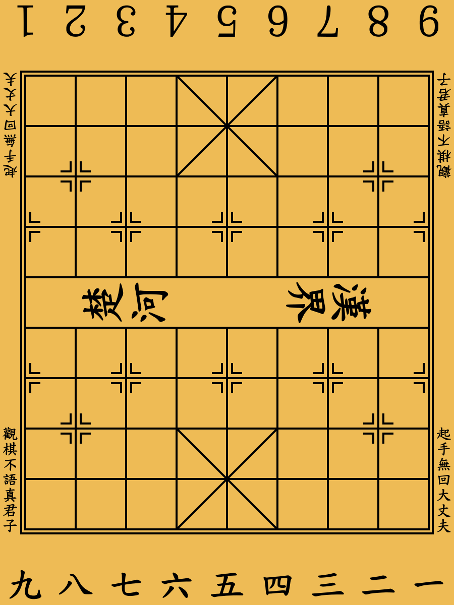
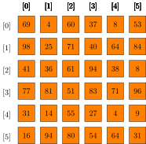
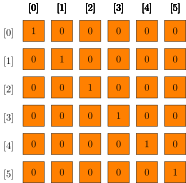
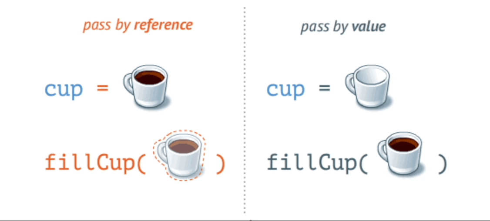

<!-- _header:  -->

# UESTC(HN) 1005 — Introductory Programming

Lecture 7 — Multidimensional Arrays and Pointers

Hasan T Abbas
[Hasan.Abbas@glasgow.ac.uk](mailto:Hasan.Abbas@glasgow.ac.uk)

<!-- transition: fade -->
<!-- <style scoped>a { color: #eee; }</style> -->

<!-- This is presenter note. You can write down notes through HTML comment. -->

---

# Questions :question:


[https://www.menti.com/alvdovrctoj1](https://www.menti.com/alvdovrctoj1) and type the code `7103 4994`.

---

# A Journey ... that takes time!

<!-- Import Hanzi Writer HTML Stuff -->

<div class="hanzi-word-container">
  <div id="hanzi-char-1"></div>
  <div id="hanzi-char-2"></div>
  <div id="hanzi-char-3"></div>
</div>

<script src="https://cdn.jsdelivr.net/npm/hanzi-writer@3.7.2/dist/hanzi-writer.min.js"></script>

<script>
  const writerOptions = {
    width: 250,
    height: 250,
    padding: 5,
    showCharacter: false, // Make character invisible initially
    showOutline: false,   // Make outline invisible initially
    strokeAnimationSpeed: 1.5,
    delayBetweenStrokes: 50,
    radicalColor: '#093867' // glasgow
  };

  const writer1 = HanziWriter.create('hanzi-char-1', '智', writerOptions);
  const writer2 = HanziWriter.create('hanzi-char-2', '至', writerOptions);
  const writer3 = HanziWriter.create('hanzi-char-3', '技', writerOptions);

  // Use an async function for a cleaner animation loop
  async function animateAndLoop() {
    // Loop forever
    while (true) {
      // Animate each character in sequence, waiting for each to finish
      await writer1.animateCharacter();
      await writer2.animateCharacter();
      await writer3.animateCharacter();

      // Pause for 5 seconds to show the completed word
      await new Promise(resolve => setTimeout(resolve, 10000));

      // Hide the characters again to prepare for the next loop
      writer1.hideCharacter();
      writer2.hideCharacter();
      writer3.hideCharacter();
    }
  }

  animateAndLoop();
</script>

---

<div class="video-wrap">
  <video src="assets/musa1.mp4" controls width="25%"></video>
</div>

---


<div class="columns">
<div class="columns-left">

# Lecture Outline

- Multidimensional Arrays
- Function Calls
- Pointers 🔑



---

# Multidimensional Arrays

- 2D array like a matrix (as in mathematics)

```C
int table[5][5]; // creates a 2D array of 5 rows and 5 columns
```

- How much size does a 2D array take?


```C
printf("size of array = %zu bytes\n", sizeof(table)); // %zu is for unsigned long
```



---

# Use in Mathematics 📐

- 2D matrices heavily used in matrix manipulation
- Backbone of linear algebra and numerical computation



```C
#include <stdio.h>
#define N 6 // size of the matrix size is always 1 more
int main(void)
{

    int ident_matrix[N][N];
    int row, col;
    for (row = 0; row < N; row++)
        for (col = 0; col < N; col++)
            if (row == col)
                ident_matrix[row][col] = 1;
            else
                ident_matrix[row][col] = 0;
    return 0;
}
```

---

# Multidimensional Array Initialisation 

```C
int matrix[8][8] = {
        {1, 1, 0, 0, 0, 0, 1, 1},
        {1, 0, 1, 1, 1, 1, 0, 1},
        {0, 1, 0, 1, 1, 0, 1, 0},
        {0, 1, 1, 1, 1, 1, 1, 0},
        {0, 1, 0, 1, 1, 0, 1, 0},
        {0, 1, 1, 0, 0, 1, 1, 0},
        {1, 0, 1, 1, 1, 1, 0, 1},
        {1, 1, 0, 0, 0, 0, 1, 1}
    };
```


```C
printf("&array[%d][%d] = %p\n", row, col,  (void *)&ident_matrix[row][col]);
```


- Empty elements are initialised to `0`
- C treats multidimensional arrays as 1D essentially.
- We can go out of bounds in terms of indices.

---

# Function Calls and Arrays 🔑

- Recall the concept of <span style="color:green">passing by reference</span> and <span style="color:red">by value</span>

```C
someFunction(ArrayName); // passing by reference. Array name is a pointer
```

### Passing by Reference
- We pass the <span style="color:green">array name</span> i.e., a pointer (we will talk about it shortly)
- Since we pass the memory locations, contents are changed inside the function



---

# Passing by value

- We pass individual elements of the array
- There is no pointer passed
- No changes made to the original array contents

```C
someOtherFunction(AnotherArrayName[0]); // passing by value. Argument is an element
```

---

# <!--fit--> <span style="color:white"> Pointers </span>


---

# Pointers 🔑

- Just another data type
- A key feature of C
- Allows <span style="color:green">byte-sized</span> memory access
- A variable that stores the memory address of another variable.

```C
int *ptr; // -> The variable ptr stores a pointer to an int
```

---

# <!--fit--> <span style="color:white"> Pointer stores the **address** of a memory location </span>


---

# Why Pointers? 🤔

- Efficient memory management.
- Allows functions to modify variables directly.

---

# So what is all about Pointers?

- How to create/declare pointers?
- `&` (address-of): Gets the memory address.
- `*` (dereference): Accesses the value at the memory address.

```C
int a = 10;  // declare an integer variable
int *ptr; // declare a pointer 
ptr = &a;  // and initialize it to the address of 'a'
printf("%d", *ptr);  // dereference the pointer and print the value it points to
```

---

# Initialising and Indirect Assignment

- Pointers are like a map
- Variables are stored in memory, each at a unique address.
- <span style="color:red">Address Representation</span>
- Pointers allow access to these addresses directly.
- E.g., `int x = 5;` & `int *p = &x;`
- `p` now holds the memory address of `x`.


---

# Example 🔑

```C
#include <stdio.h> // which has definitions of printf function

int main() // void means nothing
{
    int a = 10;         // declare an integer variable
    int *ptr;           // declare a pointer
    ptr = &a;          // and initialize it to the address of 'a'
    printf("%d\n", *ptr); // dereference the pointer and print the value it points to
    printf("%p\n", ptr); // print the value the pointer points to
    printf("%p\n", &a); //  print the address of a
    printf("%p\n", a); //  print the value of a
    return 0;
}
```

---

# Two Pointers

```C
#include <stdio.h> // which has definitions of printf function

int main() // void means nothing
{
    int a = 10; int b =20;         
    int *ptr1, *ptr2;           
    ptr1 = &a;          
    ptr2 = &b;
    printf("%d\n", *ptr1); 
    printf("%p\n", ptr2); 
    printf("%p\n", &a); 
    printf("%p\n", &b); 
    return 0;
}
```

---

# Pointer Arithmetic

- What happens when we perform arithmetic?
- We can simply *add*, *subtract* on pointers

```C
char *p;
char a;
char b;
p = &a;
p += 1;
```

- Adds `1*sizeof(char)` to the memory address
- The pointer `p` now points to ?? 🤔

---

# The Dangling Pointer ❗

- Null Pointer (`NULL`)
- A pointer that doesn’t point to any address: `int *p = NULL;`
- A pointer pointing to deallocated memory.
## **Best Practice**
- Always initialise pointers, and set to `NULL` after freeing memory.
- Avoid unexpected behaviour and crashes 🛑
- Memory area can be reused and data can be corrupted
- Modern compilers take care of this 😎
- start pointer names beginning with `p`, eg. `px`

---

# Questions :question:


[https://www.menti.com/alvdovrctoj1](https://www.menti.com/alvdovrctoj1) and type the code `7103 4994`.


---

# Next Up ⏭️

- Pointers contd.
- Strings
- Bring your Laptops!

<!--  -->