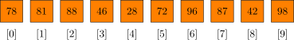
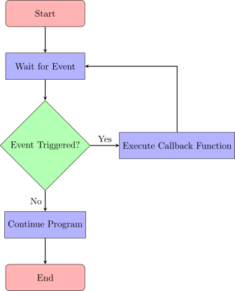

<!-- _header:  -->

# UESTC 1005 — Introductory Programming

Lecture 8 — Pointers contd.

Hasan T Abbas
[Hasan.Abbas@glasgow.ac.uk](mailto:Hasan.Abbas@glasgow.ac.uk)

<!-- transition: fade -->
<!-- <style scoped>a { color: #eee; }</style> -->

<!-- This is presenter note. You can write down notes through HTML comment. -->

--- 

# A Journey ... that takes time (Improved Version 🙂)!

<!-- Import Hanzi Writer HTML Stuff -->

<div class="hanzi-word-container" style="display:flex; align-items:center; gap:4px; font-size:60px;">
  <div id="hanzi-char-1"></div>
  <span class="quote">“</span>
  <div id="hanzi-char-2"></div>
  <span class="quote">”</span>
  <div id="hanzi-char-3"></div>
  <span class="quote">“</span>
  <div id="hanzi-char-4"></div>
  <span class="quote">”</span>
</div>

<script src="https://cdn.jsdelivr.net/npm/hanzi-writer@3.7.2/dist/hanzi-writer.min.js"></script>

<script>
  const opts = {
    width: 170,
    height: 150,
    padding: 5,
    showCharacter: false,
    showOutline: false,
    strokeAnimationSpeed: 1.5,
    delayBetweenStrokes: 50,
    radicalColor: '#093867'
  };

  const writers = [
    HanziWriter.create('hanzi-char-1', '从', opts),
    HanziWriter.create('hanzi-char-2', '知', opts),
    HanziWriter.create('hanzi-char-3', '到', opts),
    HanziWriter.create('hanzi-char-4', '技', opts)
  ];

  const quotes = document.querySelectorAll('.quote');

  async function animateLoop() {
    while (true) {
      // Animate the full phrase sequentially with quotes appearing in sync
      quotes[0].style.opacity = 1;
      await writers[0].animateCharacter(); // 从
      await new Promise(r => setTimeout(r, 200));

      await writers[1].animateCharacter(); // 知
      quotes[1].style.opacity = 1;
      await new Promise(r => setTimeout(r, 300));

      await writers[2].animateCharacter(); // 到
      quotes[2].style.opacity = 1;
      await new Promise(r => setTimeout(r, 200));

      await writers[3].animateCharacter(); // 技
      quotes[3].style.opacity = 1;

      // Hold for 5s
      await new Promise(r => setTimeout(r, 5000));

      // Reset everything
      writers.forEach(w => w.hideCharacter());
      quotes.forEach(q => q.style.opacity = 0);
    }
  }

  // Initialize quotes as hidden
  quotes.forEach(q => q.style.opacity = 0);

  animateLoop(); 
</script>

---

# Questions from Last time? :question:


---

<div class="columns">
<div class="columns-left">

# Lecture Outline

- Pointers and Arrays
- Dynamic Memory Allocation
- Pointers and Functions
- Pointers to Pointers


<!--  -->

---

# Some Fun

<video controls width="600">

  <source src="assets/Blinky_pointer.mp4" type="video/mp4" />

  Download the
  <a href="assets/Blinky_pointer.mp4">MP4</a>
  video.
</video>

---

# The Dangling Pointer ❗

- Null Pointer (`NULL`)
- A pointer that doesn’t point to any address: `int *p = NULL;`
- A pointer pointing to deallocated memory.
## **Best Practice**
- Always initialise pointers, and set to `NULL` after freeing memory.
- Avoid unexpected behaviour and crashes 🛑
- Memory area can be reused and data can be corrupted
- Modern compilers take care of this 😎
- start pointer names beginning with `p`, eg. `px`

---

# First a Recap

- **Pointer** is a variable that stores the address of another variable
- Efficient memory management
- Direct access to data
- Dynamic memory handling.

```C
#include <stdio.h> // which has definitions of printf function

int main() // void means nothing
{
    int x = 10;
    int *ptr = &x;
    printf("%d\n", *ptr);  // Outputs 10
    return 0;
}
```

---

# Pointers and Arrays

- Array name is a constant pointer to the first element
- Syntax equivalence,
`arr[i] == *(arr + i);`




```C
int arr[] = {78, 81, 88};
printf("%d\n", arr[1]);       // Outputs 81
printf("%d\n", *(arr + 1));   // Also outputs 81
```

---

# Traversing Arrays with Pointers

```C
int arr[] = {78, 81, 88, 46, 28, 72, 96, 87, 42, 98};
int *ptr = arr;
for (int i = 0; i < 10; i++) {
    printf("%d ", *(ptr + i));
}
```


---

# Modifying Arrays via Pointers

- Change array elements using pointers
- Recall the concept of <span style="color:green">passing by reference</span>

```C
int arr[] = {78, 81, 88, 46, 28, 72, 96, 87, 42, 98};
int *ptr = arr;
for (int i = 0; i < 10; i++) {
    printf("%d ", *(ptr + i));
}
*(ptr + 4) = 20;  // Modifies arr[4]
for (int i = 0; i < 10; i++) {
    printf("%d ", *(ptr + i));
}
```

---

# Flipping an Array 🐬

- Let's reverse the elements of an array

```C
void reverseArray(int *arr, int size) {
    int *start = arr, *end = arr + size - 1;
    while (start < end) {
        int temp = *start;
        *start = *end;
        *end = temp;
        start++;
        end--;
    }
}
```

---

# What is Dynamic Memory? 🧠

- Standard arrays (`int arr[10];`) have a fixed size.
- This size <span style="color:red">must</span> be known at compile time.
- **<span style="color:orange">Problem</span>** What if we don't know the size? (e.g., user input `n`)
- **<span style="color:green">Solution</span>** We need a new place to store data.
- To do this, we must understand our two memory areas:
- **The Stack** and **The Heap**

---

# The Stack: "Fast Food Counter" 🥞

- **What it is:** Where your local variables live (`int x;`, `char arr[10];`).
- **How it works:**
    - **Automatic:** Functions get memory when called.
    - **Fast:** Just moves a single pointer (the "stack pointer").
    - **LIFO:** "Last-In, First-Out." The last function called is the first to leave.
- **Cleanup:** **Automatic!** When a function ends, its variables are *instantly* gone.
- **Problem:** Fixed, small size. Can get a **Stack Overflow**.

---

# The Heap: "The Dining Hall" 🍽️

- **What it is:** A large, open pool of memory.
- **How it works:**
    - **Manual:** You must *ask* for memory with `malloc()`.
    - **Flexible:** You can ask for *any size* at *any time*.
    - **You get a pointer:** `malloc` returns an *address* (your "table number").
- **Cleanup:** **Manual!** You *must* return the memory with `free()`.
- **Problems:**
    - **Memory Leaks:** Forgetting to `free()`.
    - **Dangling Pointers:** Using memory *after* you `free()` it.

---

# Stack vs. Heap: Summary 📊

| Feature | The Stack (Automatic) | The Heap (Manual) |
| :--- | :--- | :--- |
| **Allocation** | Automatic (function call) | Manual (call `malloc()`) |
| **Deallocation** | Automatic (function return) | Manual (call `free()`) |
| **Speed** | Very Fast | Slower |
| **Size** | Small, Fixed | Large, Flexible |
| **Managed By** | Compiler | **You (The Programmer)** |
| **Bug** | Stack Overflow | Memory Leak / Dangling Pointer |

---

# The Tools: `malloc()` & `free()` 🛠️

- **`#include <stdlib.h>`** (Required!)
- Now that we know about **The Heap**, here are its tools:
- `malloc(size_t size)`
    - "Memory Allocate"
    - Asks the "Heap" for `size` bytes.
    - Returns a `void*` (generic pointer) to that memory.
- `free(void* ptr)`
    - Returns the memory to the "Heap".
    - **Forgetting to `free` causes a Memory Leak!** 💧

---

# Dynamic Array: The Pattern 📝

```c
int n = 10; // This 'n' could come from user input!
int *arr;

// Ask the Heap for memory
arr = (int*)malloc(n * sizeof(int));

// Check for failure!
if (arr == NULL) {
    printf("Error: Memory allocation failed!\n");
    return 1;
}

// Use the memory (it's just an array)
arr[0] = 100;
printf("%d\n", arr[0]);

// Free the memory (Return it to the Heap)
free(arr);
```

---


# <!--fit--> <span style="color:white"> Pointers and Functions </span>


---

# Passing Variables by Reference 

- Pointers allow a function to modify a variable directly 🔑

```C

void increment(int *val) {
    (*val)++;
}

int x = 5;
increment(&x);
printf("%d\n", x);  // Outputs 6
```
--- 

# 🚧 Pointer to a Function ❗

- Just like a variable, a function is also stored in the memory
- A **pointer to a function** stores the address of a function.
- <span style="color:red">Function pointers are useful for passing functions as parameters to other functions </span>

```C
   return_type (*pointer_name)(parameter_list);
```

```C
int add(int a, int b) {
    return a + b;
}
func_ptr = &add;  // or simply func_ptr = add;
```

```C
int result = func_ptr(10, 20);  // Calls the add function
printf("Result: %d\n", result);
```

---

# Example - Function Pointer

```C
#include <stdio.h>

int add(int a, int b) {
    return a + b;
}

int subtract(int a, int b) {
    return a - b;
}

void executeOperation(int (*operation)(int, int), int x, int y) {
    printf("Result: %d\n", operation(x, y));
}

int main() {
    executeOperation(add, 10, 5);        // Outputs: Result: 15
    executeOperation(subtract, 10, 5);  // Outputs: Result: 5
    return 0;
}
```

---

# Why Function Pointers

- Callbacks in Event Handling
- i.e. Pass a function to be executed on an event trigger.
- Dynamic Function Selection:
- i.e. Switch between multiple behaviours at runtime (e.g., add vs. subtract).
- Sorting with Custom Comparators:
- Pass comparison functions to sorting algorithms.

---

# Callbacks in Event Handling

- Imagine a doorbell 🛎️. When someone presses the doorbell (event), you want to trigger an action (function) like turning on a light or playing a sound.
- Callbacks in event handling work similarly.
- When this event happens, execute a specific function.

```C
void onClick() {
    printf("Button clicked!\n");
}

void simulateButtonClick(void (*callback)()) {
    // Simulate a button click
    callback();  // Call the provided function
}

int main() {
    simulateButtonClick(onClick);  // Register the onClick callback
    return 0;
}
```



---

# Dynamic Function Selection

- Now imagine a calculator 🧮 where you can add, subtract, multiply, or divide.
- The action you want depends on what the user selects at runtime.
- With a callback, you can pass the desired operation (add, subtract, etc.) as a function and execute it dynamically.

---

# Function Pointer Example

- Write a program that uses a function pointer to perform addition, subtraction, multiplication, and division based on user input.
- Widely used in frameworks, APIs, and system-level programming.

---

# Const Pointers in Functions

- Sometimes, we would to protect certain data
- We can use `const` to prevent modifications

```C
void printArray(const int *arr, int size) {
    for (int i = 0; i < size; i++) {
        printf("%d ", arr[i]);
    }
}
```

---

# <!--fit--> <span style="color:white"> Pointers to Pointers </span>


---

# Pointers to Pointers 🤔

- A pointer storing the address of another pointer
- Allows functions to modify variables directly.

```
 54   55   56   57   58   59   60   61   62   63   64   65   66   67   68   69
+----+----+----+----+----+----+----+----+----+----+----+----+----+----+----+----+
|    | 58 |    |    | 62 |    | 55 |    | H  | a  | i  | n  | a  | n |  \0 |    |
+----+----+----+----+----+----+----+----+----+----+----+----+----+----+----+----+
```

```C
const char *pString = "Hainan";
const char **ppString = &pString;
const char ***pppString = &ppString;
```

---

# Pointers to Pointers

- Accessing Data through a pointer to a pointer

```C
int x = 100;
int *p = &x;
int **pp = &p;

printf("%d\n", **pp);  // Outputs 100
```

---

# Putting it all Together 🍱

- Dynamic Memory Allocation
- Allows the creation of arrays whose size is determined at runtime.
- Allocates memory only as needed, avoiding wastage.

```
array -> | row1 | row2 | row3 |
          /        |       \
         [10, 20] [30, 40] [50, 60]
```

---

# Questions? :question:
 


---

# Next Up ⏭️

- Tutorial at 2 PM today! Encouraged to attend!
- Strings 🧵
