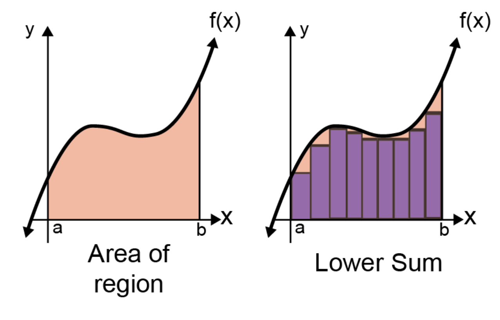

# "Manipulating strings in C or C++ is error prone."
# "If the pointer is not pointing to a valid object or function, bad things may happen."

## &mdash; Robert C. Seacord (computer security expert and respected author)


---

<!-- _header:  -->

# UESTC 1005 — Introductory Programming

Lecture 9 - Strings and Structures

Mark D. Butala
[Mark.Butala@glasgow.ac.uk](mailto:Mark.Butala@glasgow.ac.uk)

<!-- transition: fade -->
<!-- <style scoped>a { color: #eee; }</style> -->

<!-- This is presenter note. You can write down notes through HTML comment. -->

---

<div class="columns">
<div class="columns-left">

# Lecture Outline

- Strings🧵
- Structure 🍱
- Structure pointers ↗️


<!--  -->

---

# But First a Recap...

- A **pointer** is a variable that stores the address of another variable
- Useful for memory management:
  + Direct access to data
  + Dynamic memory handling


```C
#include <stdio.h>

int main()
{
    int x = 10;
    int *ptr = &x;
    printf("%d\n", *ptr);  // Outputs 10
    return 0;
}
```

---

# Function Pointer Example: Numerical Integration

- Consider a C function `quadrature` that calculates a numerical integral (数值积分)
- Recall the Riemann sum (黎曼和):

$$
\begin{aligned}
\int_a^b f(x)\, dx \approx \Delta \sum_{i=0}^{N-1} f(a + i\Delta) && \text{where} && \Delta = \frac{b-a}{N}
\end{aligned}
$$





---

# Function Pointer Example: Numerical Integration

- The `quadrature` function has the following parameters:
  + A pointer to the function to integrate, i.e., the integrand (被积函数)
  + The left and right endpoints, i.e., $a$ and $b$
  + The number of subintervals (为子区间的数量), i.e., $N$


```c
double quadrature(double (*integrand)(double), double a, double b, size_t N)
```

- The variable `integrand` is a pointer to a function
   + One `double` input parameter
   + Returns a `double`

---

# Function Pointer Example: Numerical Integration

```c
// integrand = 被积函数
double quadrature(double (*integrand)(double), double a, double b, size_t N) {
    double accum = 0;
    double delta = (b - a) / N;
    for (size_t i = 0; i < N; i++) {
        accum += integrand(a + i*delta);
    }
    return accum * delta;
}

double x_squared(double x) {
    return x * x;
}

double x_cubed(double x) {
    return x * x * x;
}

int main(void) {
    size_t N = 10000;
    printf("Integral of x^2 from 0 to 10 ~= %f\n", quadrature(x_squared, 0, 10, N));
    printf("Integral of x^3 from 0 to 1  ~= %f\n", quadrature(x_cubed, 0, 1, N));
    return 0;
}
```

---

# <!--fit--> <span style="color:white"> Strings in C</span>


---

# Strings 🧵

- An array of characters terminated by the **null character** (`\0`)
- A contiguous block of memory where each character is accessible via indexing or pointers
- The C standard library (`string.h`) includes many useful string manipulation functions


```c
char str[10] = "Hainan";
```

```
 54   55   56   57   58   59   60   61   62   63   64   65   66   67   68   69
+----+----+----+----+----+----+----+----+----+----+----+----+----+----+----+----+
| 62 | 22 | 55 | 1  | H  | a  | i  | n  | a  | n  | \0 | 22 | 42 | 42 | 10 | 3  |
+----+----+----+----+----+----+----+----+----+----+----+----+----+----+----+----+
```

---

# The `string.h` Standard Library

- `#include <string.h>` provides many useful string functions:
  + `strcat(str1, str2)`: concatenates two strings
  + `strcpy(str1, str2)`: copies one strings to another
  + `strcmp(str1, str2)`: compare the elements of two strings
  + `strlen(str)`: compute the length of a string
<!--

```C
char str1[10] = "UESTC";
char str2[10] = "1005";
printf("%s %s", str1, str2); // %s placeholder for strings
strcat(str1, str2); // concatenates two strings
strcpy(str1, str2); // copies one strings to another
strcmp(str1, str2); // compare the elements of two strings
strlen(str1);
```

-->

- The variants `strncat`, `strncpy`, and `strncmp` include a size parameter and are generally "safer" than their counterpart functions
  + E.g., `strncpy(str1, str2, 9)` copies only the portion of `str2` that fits in the memory reserved for `str1`
- Further reference: https://en.cppreference.com/w/c/string/byte

---

# ⚠️ `strcat`, `strcpy`, and `strcmp` can be dangerous

For example, the programmer is responsible that:
- The input parameters are strings (null terminated arrays)
- The destination array is large enough to accommodate the result
- Failure to do so may result in runtime failure (segmentation violation)

``` C
char str1[3];
char str2[] = "I AM A VERY LONG STRING";
strcpy(str1, str2);  // compiles, but will (likely) fail at runtime
```

---

# Strings and Pointers

- Everything we said about arrays is also true for strings
- The name of the string points to the first string element
- Used in efficient data processing involving text

```C
char str[] = "UESTC 1005";
char *ptr = str;          // Points to the first character of str
printf("%c", *(ptr + 1)); // Outputs 'E'
printf("%s", *(ptr + 6)); // Outputs '1005'
```

```C
char *str = (char *) malloc(10 * sizeof(char));
```

---

# String Tokenisation 🇬🇧💂‍♂️🏏 (I cringe 😬 and want to change the slide title to String Tokenization 🇺🇸🗽⚾)

- Split a single string into multile components (tokens, 字符串标记)
- For example, how to split an IP address `192.168.1.1` into its four octet components?
- The `strtok` function splits a string based on specified *delimiters* (字符串分隔符), i.e., a set of characters that denote a break between tokens
- The "string tokenize" function in `string.h` has the following function signature:

```C
char *strtok(char *str, const char *delim);
```

- Powerful and useful function, but it is relatively complex

---

# The `strtok` Function

- Major source of complexity: first call is different from subsequent calls

```C
#include <stdio.h>
#include <string.h>

int main() {
    char str[] = "apple,banana,orange";
    char *token;

    // Get the first token
    token = strtok(str, ",");
    while (token != NULL) {
        printf("%s\n", token); // Print the token
        token = strtok(NULL, ","); // Get the next token
    }

    return 0;
}
```

---

# String equality 🟰

- It might be tempting to write the following code to determine if two strings are equal:

``` C
#include <stdio.h>
int main() {
    char str1[] = "string";  char str2[] = "string";
    printf("str1 == str2? %d\n", str1 == str2);
    // always outputs "str1 == str? 0"
    return 0;
}
```

- In the above, `str1 == str2` is always false because `str1` (the address of string 1) will be different than `str2` (the address of string 2)
- The `strcmp` (or the safer `strncmp`) function is for string comparison
  + If `strcmp(str1, str2) == 0` then `str1` is equal to `str2`


---

# Lexicographic order

- The result of `strcmp` can also be positive or negative, indicating `str1 < str2` or `str1 > str2`, but what does this mean?
- If `str1 < str2` then `str1` appears before `str2` in an "ASCII special character aware" dictionary (ASCII 字典序)

``` C
#include <stdio.h>
#include <string.h>
int main() {
    printf("strcmp(apple, apple) = %d\n", strcmp("apple", "apple"));  //  0
    printf("strcmp(Apple, apple) = %d\n", strcmp("Apple", "apple"));  // -1
    printf("strcmp(Apple, !pple) = %d\n", strcmp("Apple", "!pple"));  //  1
    printf("strcmp(Apple, App)   = %d\n", strcmp("Apple", "App"));    //  1
}
```

---

# <!--fit--> <span style="color:white"> Structures in C</span>


---

# So What is a Structure 🍱?

- A user-defined data type with group of variables of different types
- Better data organisation
- Allocate storage all at once

```C
struct StructureName {
    dataType1 member1;
    dataType2 member2;
};
```

```C
struct Person {
            char    name[10];
            int     age;
            char    gender;
            double  weight;
};
```

---

# Why Structures? 🤔

- Organise related data together

```C
struct Coordinate {
    int x, y, z;
};
struct Coordinate p1 = {10, 20, 30};
```

```C
// dynamic memory allocation for a Coordinate
struct Coordinate *p = (struct Coordinate *) malloc(sizeof(struct Coordinate));
(*p).x = 10; (*p).y = 20; (*p).z = 30;
```

---

# Structure Member Access


- The *dot operator* is used to peer into a structure and access its members:
```C
struct Coordinate {
    int x, y, z;
};
struct Coordinate p1 = {10, 20, 30};
p1.x = 15;
printf("%d", p1.x);
```

- Example of member access using a pointer:

```C
struct Coordinate *coord_ptr = &p1;
coord_ptr->x = 15;
```

- Note that the *arrow operator* `coord_ptr->x` is equivalent to `(*coord_ptr).x`


---

# An Array of Structures

- Consider the example of a student database

```C
// Record for a single student
struct Student {
    char name[50];
    int age;
    float grade;
};
```
- Suppose `sizeof(char)` is 1 and `sizeof(int)` and `sizeof(float)` are 4. What is `sizeof(struct Student)`?
- For performance reasons (byte alignment), the correct answer is different than what you might assume: `sizeof(struct Student) >= 50*1 + 4*1 + 4*1 = 58`

---


# Passing an Array of Structures to a Function

- An array of structures can be efficiently (by reference) passed to a function

```C
// Function to calculate average grade
float calculateAverageGrade(struct Student students[], int size) {
    float total = 0;
    for (int i = 0; i < size; i++) {
        total += students[i].grade;
    }
    return total / size;
}

int main() {
    // Declare an array of 100 Student structures
    struct Student students[100];
    // Initialization of students happens here
    float average_grade = calculateAverageGrade(students, 100);
    return 0;
}
```

---

# Structure Pointers

- A pointer to a structure points to the memory address where the structure is located
- If the structure contains an array member, that pointer can be used to indirectly access the array elements

```C
struct Student {
    char name[50];       // Name of the student
    int grades[5];       // Array to store 5 grades
};

// declare and initialize a structure variable
struct Student s = {"NAME", {1, 2, 3, 4, 5}};
// declare and initialize a pointer to a structure
struct Student *s_ptr = &s;
```

- Advanced topic: A structure can contain a self-referencing pointer (useful for constructing dynamic data structures, e.g., a *linked list* or *tree*)

---

# Structure Pointer Example

```C
#include <stdio.h>

struct Student {
    char name[50];       // Name of the student
    int grades[5];       // Array to store 5 grades
};

int main() {
    // Declare and initialize a structure
    struct Student ip_student = {"DaXue Sheng", {85, 90, 88, 92, 67}};

    // Declare a pointer to the structure
    struct Student *ptr = &ip_student;

    // Access array elements using the pointer
    printf("Student Name: %s\n", ptr->name);
    printf("Grade 1: %d\n", ptr->grades[0]);
    printf("Grade 5: %d\n", ptr->grades[4]);

    return 0;
}
```

---


# Mixing it all Together 🥣

- We could have a pointer to the structure allowing indirect access
- We can have an array of pointers to structures
- Many possible solutions to a given problem!

<!-- --- -->

<!-- # Course Feedback - Dr Hasan Abbas

 -->

---

# Next Up ⏭️

- Bit Manipulation and Structures
