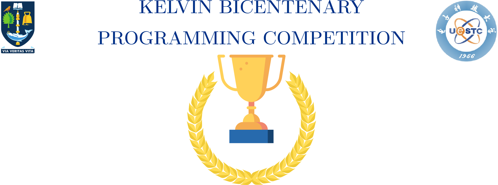

---

# First Position - Jiale Liu

<!-- transition: fade -->
<!--  -->

<!-- This is presenter note. You can write down notes through HTML comment. -->

---

# Second Position - Ma Wen Xi

<!-- transition: fade -->
<!--  -->

<!-- This is presenter note. You can write down notes through HTML comment. -->

---

# Third Position - Yue Zuo

<!-- transition: fade -->
<!--  -->

<!-- This is presenter note. You can write down notes through HTML comment. -->

---

# Freshman Award - Cheng He

<!-- transition: fade -->
<!--  -->

<!-- This is presenter note. You can write down notes through HTML comment. -->

---

# Share your Thoughts on the Event

- Please complete the survey at the QR code

