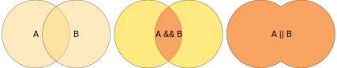

<!-- _header: ).jpg) -->

# UESTC 1005 - Introductory Programming

Lecture 4 - Operators and Program Control

Dr Hasan T Abbas

<!-- <style scoped>a { color: #eee; }</style> -->

<!-- This is presenter note. You can write down notes through HTML comment. -->

---

# About Me

- IP Course Coordinator since 2019
- Research Interests in Numerical Electromagnetics
- Fascinated by Nanoscale Physics
- Also dabbles in Artificial Intelligence :brain: and Healthcare Technologies :hospital:


---

# Lecture Outline

- Dive deeper into operators (运算符)
- Make Decisions
- Introduce program control

---

# Operators

In the last lecture, we looked at a number of operators available in C. 
C has in fact many more, and mastering all of them takes time. 

- Interestingly, the results of operators as sometimes hardware dependent.
- Let's look at some interesting observations.

---

# <span style="color:red">Some Side Effects</span>

Some unexpected results:

```C
int i;
float pi;
pi = i = 3.1416f;
```

The `float` variable `f` is assigned a value of `3.0` (as opposed to `3.1416`).

<span style="color:green">better to use multiple statements to avoid unexpected behaviour</span>

---

# <span style="color:orange">Example - Operators</span> :placard:


Write a C program where you are going to enter a *three-digit* number which is then printed on the screen.

Task is to reverse the number. Example output of the program:

```
Enter a three-digit number: 123
Reversed number is: 321
```
----

# <span style="color:orange">Example - Operators</span> :placard:

## Method
- We need to extract the three digits from the number
- Split the number `n` into units, tens and hundreds
- Units -- `n % 10` gives us the right-most digit
- Hundreds -- `n % 100` gives us the hundreds
- For tens, we need to do two steps, first remove the hundred `temp = n % 100` and then get the tens part, `ten = temp % 10` gives us the tens in the number

For swapping, we can simply display the number in the reverse order (`unit`,`tens` and `hundred`).

---


# <span style="color:orange">Example - Operators</span>

```C 
#include <stdio.h>
int main(void)
{
    int input, unit, ten, hundred;
    int temp; // for temporarily storing a value

    printf("\nEnter a three-digit number: ");
    scanf("%d", &input);

    hundred = input / 100; // Get the hundred
    temp = input % 100;  // remove the hundred
    ten = temp / 10;  // Get the ten
    unit = input % 10; // Get the unit

    printf("\n\nThe reversal is %d%d%d\n\n", unit, ten, hundred);
    return 0;
}
```
---

# Selection and Decisions

C has three kinds of statements (selection, iteration, jump) that can help make decisions and select choices.



Today we will look at `if` and `switch` statements along with relational and logical operators.

---

# Logical Expressions

We need to check an expression to see if it is `true` or `false`. 

- Like, check whether ` i < j` is `true` or `false`
- The above `(i < j)` is a logical expression. 
- Result is an integer, `1` for true, and `0` for false
- We usually call it *Boolean* logic
- We can have relational operators such as `<`,`>`,`<=`,`>=` to *compare* two or more values

---

# Logical Operators 

- Complex logical expressions built by combining simpler ones
- This is done using the *logical operators* 

| Symbol | Meaning |
| :---: | :--- |
| `!` | logical negation |
| `&&` | logical AND |
| `\|\|` | logical OR |

As discussed in last lecture, the output of the logical expressions with logical operators is either `0` or `1`.

---

# Venn Diagram Visualisations 

Logical operators are best understood using Venn diagrams



---
# :warning: Clearing some Confusion

We often confuse `==` with `=` operator
- `==` is used for *comparison*. For example, is `i` equal to `10` can be written as `i == 10`.
- `=` is used for *assignment*, eg. `i = 3;`.

---

# The `if` `else` Statement    

- Allows to choose between *two* choices

```C 
if (expresssion)
    {statements1}
else
    {statements2}
```

---

# Example - Diagnosing Diabetes

We can use `if` selection statement whether a person is suffering from diabetes or not.

- Definition of diabetes according to World Health Organisation
- Fasting plasma :drop_of_blood: glucose (FPG) ≥126 mg/dL <span style="color:red">**OR**</span> 
- Oral glucose :drop_of_blood: tolerance test (OGTT) 2-hour glucose ≥200 mg/dL

```C
if (fpg >= 126 || ogtt_2hpg >= 200)
    diabetes = TRUE;
else
    diabetes = FALSE;
```
---

# Cascaded `if` Statements

- We often need to check a series of conditions, seeking *one* of them to be true

```C 
if (expresssion)
    {statements1}
else if
    {statements2}
...
else
    {statementsN}
```



---

# Cascaded `if` - Example :placard:

Check whether a number is positive, negative, or zero.

```C
if (n<0)
    printf("n is less than 0 \n");
else if (n==0)
    printf("n is equal to 0 \n");
else
    printf("n is greater than 0 \n ");
```

---

# Nested `if` Statements

There is also an option to use an `if` statement *inside* another one

```C 
if (expresssion)
    if
    {statements1}
    else
    {statements2}
else
    {statements3}
```



---
<div class="columns">
<div class="columns-left">

# Question :question:
Writing nested `if` statements is a poor programming practice. Can you propose a better alternative?

- Check whether a number is odd <span style="color:green">AND</span> divisible by 7.

```C
if ( !(num %2 == 0))
    if (num % 7 == 0)
        printf("%d is odd and divisible by 7", num);
    else
    printf("%d is not odd or divisible by 7", num);
```
- *Hint:* Your answer is a single line 

</div>
<div class="columns-right">


Go to the website link - [https://www.menti.com/almp8abh7wkj](https://www.menti.com/almp8abh7wkj) and type the code `8625 1887`.
</div>
</div>

---

# A Terse form of selection Statement

Conditional expressions help us execute the function of `if else` statements in a brief manner.

Syntax:
```
    expr1 ? expr2 : expr3
```

It reads as: 
If `expr1` is `true` <span style="color:green">THEN</span> execute `expr2`, <span style="color:red">OTHERWISE</span> execute `expr3`.

```C
int i, j, k;
i = 1, j = 2;
k = i < j ? i : k; // Since i < j so k gets the value k = i = 1
```

---

# The `switch` statement

Imagine you call your mobile phone service helpline, and you are presented with a series of options
- Press `1` for billing
- Press `2` for text messages
- Press `3` for international roaming
- Press `4` to speak to an agent
  
In C, we can implement the same using the `switch` statement. Options are selected using the `case` labels.



---
# `switch` - Example :placard:

```C
int main(){
    char grade = ‘B’; 
    switch(grade) {
      case 'A' :
         printf("Excellent!\n" );
         break;
      case 'B' :
      case 'C' :
         printf("Well done\n" );
         break;
      case 'D' :
         printf("You passed\n" );
         break;
      case 'F' :
         printf("Better try again\n" );
         break;
      default :
         printf("Invalid grade\n" );
	   }
   return 0;
}	
```
---

# Difference between `if` and `switch`

We can implement a given logic through either `if` or `switch` statements. 
- Matter of personal choice/taste
- `if` checks for a *condition*
- `switch` checks the variable in the argument (between the parentheses `()`) against a range of possible values.
- Code reads better if `switch` is used.

---
<div class="columns">
<div class="columns-left">

# Question :question:
You may be wondering what is the purpose of the lines with `break` statements in there
```C
int main(){
    char grade = ‘B’; 
    switch(grade) {
      case 'A' :
         printf("Excellent " );
      case 'B' :
      case 'C' :
         printf("Good " );
      case 'D' :
         printf("Average " );
      default :
         printf("Invalid grade\n" );
	   }
   return 0;
}	
```
</div>
<div class="columns-right">


- [https://www.menti.com/almp8abh7wkj](https://www.menti.com/almp8abh7wkj) and type the code `8625 1887`.
</div>
</div>
---

# `break` statement

- `break` simply *breaks* the program flow to take out of the `switch` 
- `break` is necessary to exit the `switch` statement once the particular option has been executed
- If not used, remaining cases are also executed.

---
# Today's Summary :spiral_notepad:

- Using relational operators and logical operators to describe conditions

- Using `if-else` and `switch-case` statements in C to realise decision-making

- Flow chats to visualise program flow

---

# Next up :spiral_calendar:

Loops :carousel_horse:

- We will use `for` and `while` loops

---

# Questions :question:


[https://www.menti.com/almp8abh7wkj](https://www.menti.com/almp8abh7wkj) and type the code `8625 1887`.

---