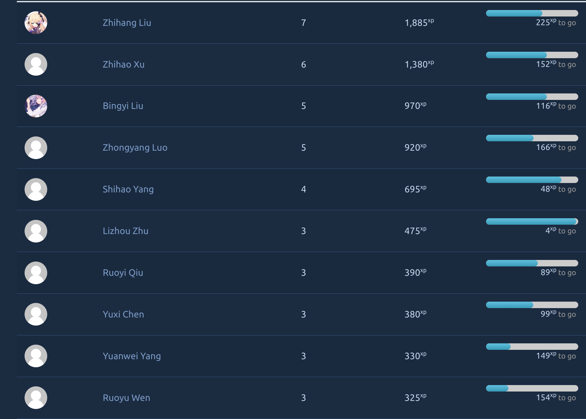
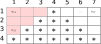
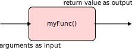
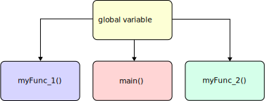

<!-- _header:  -->

# UESTC 1005 - Introductory Programming

Lecture 6 - Modular Programming

<!-- ```C
extern int add (int a, int b)
extern float add (float a, float b);
extern double add (double a,double b);
x = add(4, 0.3);
``` -->
Hasan T Abbas
[Hasan.Abbas@glasgow.ac.uk](mailto:Hasan.Abbas@glasgow.ac.uk)

<!-- transition: fade -->
<!-- <style scoped>a { color: #eee; }</style> -->

<!-- This is presenter note. You can write down notes through HTML comment. -->

---

<div class="columns">
<div class="columns-left">

# Lecture Outline

- Nested Loops :nesting_dolls:
- Modular Programming :bento:
- Functions in C
- Scope - Program Organisation :package:


---

# Moodle Stars



---

# Nested Loops 


---

# Nested Loops

## <span style="color:orange">Example - Creating a Pyramid  </span> :placard:

- Last week, we looked at `for` loops. We can have loops *within* loops
- Let's make a pyramid of `*` using nested `for` loops


---

# <span style="color:orange">Example - Creating a Pyramid  </span> :placard:

- Thinking of the screen as a 2D grid or matrix
- Need to build a logic to display ` ` and `*` on screen
- ` ` starts off with `n-1` and decreases by `1` after each iteration
- `*` starts from `1`
- `nth` row has `2n - 1` stars


---
# <span style="color:orange">Example - Creating a Pyramid  </span> :placard:

```C
void printDiamond(int n)
{
  int T = n;
  char x = ' ';
  char y = '*'; 
  for (int i = 1; i <= n; i++)
  {   
    for (int j = 1; j <= T; j++) {
      printf("%c", x);
    }
    for (int j = 1; j <= 2 * i - 1; j++){
      printf("%c",y);
    }
    printf("\n");
    T--; //
  }
}
```
--- 

# Functions :bento:

- Functions are essentially small blocks of code that perform a specific task
Using functions makes the code *tidy*
- <span style="color:red"> *Divide and conquer* </span> strategy of problem-solving
- We have seen functions like `scanf()` and `printf()` before

```C
return_type function_name (arguments);
```



---
# Basic Functions

```C 
double sum (double in1, double in2){
  return in1 + in2;
}

double average (double in1, double in2){
  return (in1 + in2)/2;
}
int main(){
  double a = 3.13;
  double b = 5.53;
  printf("The sum of %lf and %lf is %lf", a, b, sum(a,b));
  printf("The average of %lf and %lf is %lf", a, b, average(a,b));
  return 0;
}
```
Here `sum` and `average` are the names of the functions that *accept* as input two `double` type variables. Both functions return `double` type outputs once they are called.

---

# Defining a function

```C
return_type function_name (arguments)
{
  //declarations 
  //statements
}
```

- Whenever we pass a variable as an argument to the function, we always <span style="color:red"> copy</span> its value
- A function can only *return* a single value
- We can also use `void` to indicate, a function doesn't return anything


---

# Calling a Function

- Whenever a function is called, we need to pass on the list of arguments
  
```C
average(a,b);
sum(a,b);
```

<span style="color:red"> WRONG</span> :x:

```C
average;
sum();
```

---

# Function Declaration

- Typically, we define the function *before* it is used, say in the `main()` function.

```C
int main(){
  double a = 3.13;   double b = 5.53;
  printf("The average of %lf and %lf is %lf", a, b, average(a,b));
  return 0;
}
double average (double in1, double in2){
  return (in1 + in2)/2;
}
```
-  The compiler does not know what `average(a,b)` is about
-  In this case, we can use *function prototype* or *declaration* before the `main()` function

```C
double average (double, double);
```
can be placed above the main function.

---
# Some Built-in Functions

- Just like we have used `scanf()` and `printf()` functions, there are various other functions that we can use without defining them
- `math.h` library contains definitions of common mathematical functions

```C
#include<math.h>
#include<stdio.h>

int main(){
  double pi = 3.14159;
  double trig_sin = sin (pi/4);
  printf("sine of %lf is %lf", (pi/4), trig_sin);
  return 0;
}
```

---

# Passing Arguments <span style="color:green"> *by value*</span>

- We have to be careful :warning: when passing the values as an argument.
- The list should exactly match and be in order as in the definition of the function
- When *passing by value* the original variables are not modified.


---

# Passing Arguments <span style="color:red"> *by reference*</span> :key:

- In short we *modify* the value of the original variable passed to the function
- More about this when we study pointers.
- For now, recall:

```C
scanf("%d",&v);
```

The `&` is the address operator used when we are going to pass the arguments by reference.

---

# Questions :question:


[https://www.menti.com/alyevvb24kv8](https://www.menti.com/alyevvb24kv8) and type the code `4168 3514`.

---

# <span style="color:orange">Example - Make our Own Game</span> :key:

- Let's use random number generation which is part of your lab programming exercises, where you are asked to create a `getRand()` function.
- C has `rand()` function that generates a random integer number between 0 and `RAND_MAX()`(compiler dependent).
- Definition of `rand()` is stored in `stdlib.h` library.
- Intuitively, the results should be *completely* random whenever they run the code. However, by design, this is <span style="color:red"> not</span> the case.


---

# <span style="color:orange">Example - Random Number Generation</span> :bulb:

```C
#include <stdio.h>
#include <stdlib.h>

int main (){
  // loop 20 times
  for (int i = 1; i <= 20; ++i) {
    // pick random number from 1 to 6 
    printf("%10d", 1 + (rand() % 6)); // random # from 1-6
    
    // For formatting, move to new line after five results
    if (i % 5 == 0) {
      printf("\n");
      }
  }
}
```

- We get the same output, *every time* we run the code
- This is called <span style="color:crimson"> pseudorandom number generation</span>

---

# <span style="color:orange">Example - True Random Number Generation</span> :bulb:

## The `srand()` function

- Generate more randomisation through a *seed* value
- Different seed value leads to different random numbers generated
- :warning: <span style="color:red"> Same seed values still lead to the same set of random numbers </span>
- :sparkle: <span style="color:green"> introduce the system clock within `srand()` </span>

```C
srand(time(NULL)); // randomise using current time
```

- `time()` function is defined in the library `time.h`
- `NULL` refers to a *symbolic constant*. More on it in pointers.

---

# <span style="color:orange">Example - The Guessing Game</span> :1234:

- *Randomly* pick an integer between 1 and 32.
- Write a function to guess the number. The function must:
  - Accept one integer (correct answer) as an argument,
  - Read an `int` from the keyboard,
  - *Compare* the input with the correct answer,
  - Based on the comparison, displays an appropriate output such as `correct`, `too high`, or `too low`.
  - Returns a `1` if the user's guess was correct, and `0` if the user's guess was wrong.
- Give the user five chances to guess the correct answer
- Prints a message on the screen. For example, `You Win` or `You Lose`

---

# <span style="color:orange"> The Guessing Game</span> :1234:

## Random Number Generation

```C
// Generate a random number between 1 and 32
int getRand()
{

    return 1 + (rand() % 32);
}
```

The above function returns a value between 1 and 32.

---

# <span style="color:orange"> The Guessing Game</span> :1234:

## The `GuessNumber()` Function

```C
int GuessNumber(int input){
    int guess;
    printf("Guess a number between 1 and 32:\n");
    scanf("%d", &guess);
    if (guess == input){
        printf("Correct!\n");
        printf("You Win!\n");
        return 1;
    }
    else if (guess < input){
        printf("Too Low\n");
    }
    else{
        printf("Too High\n");
    }
    return 0;
}
```
---

# <span style="color:orange"> The Guessing Game</span> :1234:

## The Preamble

```C
#include <stdio.h>
#include <stdlib.h> // includes the srand() and rand() functions
#include <time.h> // includes the time() function

#define tries 5 // A directive to define a constant
``` 
---

# <span style="color:orange"> The Guessing Game</span> :1234:

## The `main()` Function

```C
int main(){
    srand(time(NULL)); // initialise the randomisation process
    int correct_answer;
    correct_answer = getRand();
    int guess;
    for (int i = 1; i <= tries; i++){
        guess = GuessNumber(correct_answer);
        if (guess == 1){
            return 0;
        }
        else{
            continue;
        }
    }
    printf("You Lose!");
    return 0;
}
```
---
# Program Organisation

## The Scope

- :warning: Caution is needed when passing variables from one function to another in a program
- C has local, and external (global) variables
- *Local variables* are only <span style="color:green"> visible</span> inside a given function
- With each function call, by default, the value of a local variable is <span style="color:red"> lost</span>
- We can `static` local variables that preserve the value in different function calls.
  Variable is allocated to the same location in the memory.

---

# Program Organisation 

## :globe_with_meridians: Global Variables

- We have seen that passing arguments is one way to *exchange* information
- Another way is to use a global (external) variable
- Their scope is throughout the file i.e., all functions can see the variable value
- Their storage is static



```C
int size = 0; // declare outside the functions
```

---

# Quiz :question:

What is the output of the following program?


```C
#include <stdio.h>
int i;
void print_one_row(void){
    for (i = 1; i <= 4; i++){
        printf("*");
    }
}
int main(){
    for (i = 1; i <= 4; i++){
        print_one_row();
        printf(" ");
    }
    return 0;
}
```

---
# Recursion :nesting_dolls:

The process of a function *calling itself*


---

# <span style="color:orange"> Example - Recursion</span> :nesting_dolls:

Some mathematical functions are ideal cases of recursion.

$$ n! = n \times (n - 1)! $$

```C
#include <stdio.h>
int factorial(int n){
    while (n >= 1){
        return n * factorial(n - 1);
    }
    return 1;
}

int main(){
    int n = 3;
    int factor = factorial(n);
    printf("Factorial of %d is %d\n", n, factor);
    return 0;
}
```
---

# <span style="color:orange"> Example - Recursion</span> :nesting_dolls:

Another one, the power function

$$ x^n = x \times x^{n - 1} $$

```C
#include <stdio.h>
int power(int x, int n){
    if (n == 0){
      return 1;
    }
    else{
        return x * power(x,n - 1);
    }
}

int main(){
    int n = 3;
    int x = 5;
    int pow = power(x,n);
    printf("Power of %d wrt %d is %d\n", x, n, pow);
    return 0;
}
```
---

# Quiz :question:

What is the output of the program below:

```C
#include <stdio.h>
void swap(int a, int b);
int main(void){
    int i = 1, j = 2;
    swap(i, j);
    printf("i = %d, j = %d\n", i, j);
    return 0;
}
void swap(int a, int b){
    int temp = a;
    a = b;
    b = temp;
}
```


Visit [https://www.menti.com/alyevvb24kv8](https://www.menti.com/alyevvb24kv8) and type the code `4168 3514`.

---

# Today's Summary :spiral_notepad:

- Nested Loops ➿
- Modular Programming through Functions 🍱
- Recursion :nesting_dolls:

---

# Next up :spiral_calendar:

## Dr Bo Liu 

- Functions continued
- Arrays

---

# Questions :question:

<!--fit-->  :goodbye:


[https://www.menti.com/alyevvb24kv8](https://www.menti.com/alyevvb24kv8) and type the code `4168 3514`.

---

# Further Reading

- An awesome :cool: online book :book:
- Lets you practice coding on site


